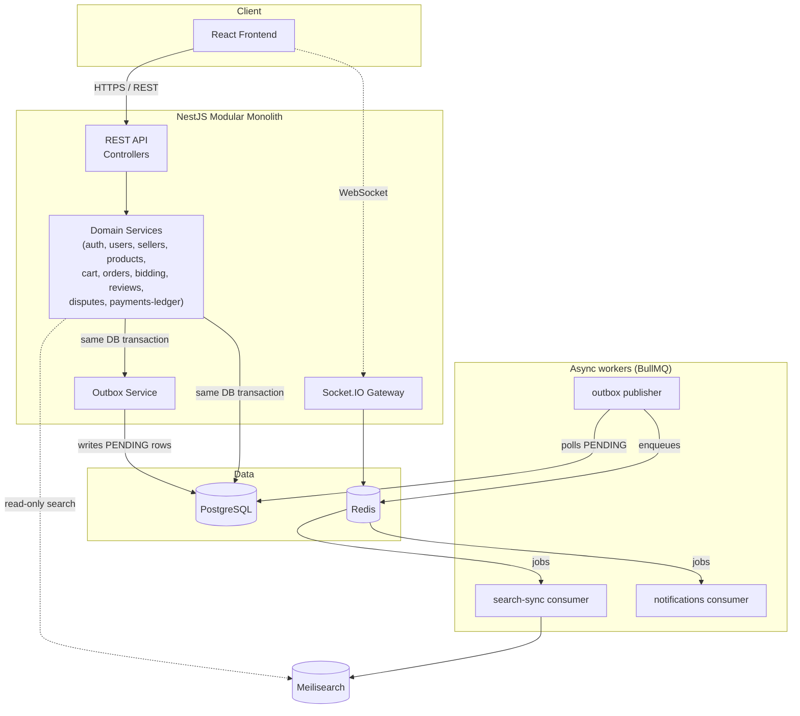

# Cargo Crew — Multi-Vendor Marketplace

A general-purpose, high-volume multi-vendor marketplace (think: many independent sellers, fixed-price and auction
listings, per-seller order splitting, commissions). This repository currently covers **Stages 1–4**: foundation +
architecture, auth + seller moderation, catalog + search, and cart/checkout/orders (see
[Current implementation status](#current-implementation-status)) — a production-minded build-out, not a finished
product. Auctions/bidding, refunds, reviews, disputes, analytics, and full realtime notifications are still ahead.

## Table of contents

- [Technology stack](#technology-stack)
- [Architecture](#architecture)
- [Why these choices](#why-these-choices)
- [Consistency model](#consistency-model)
- [Catalog & search (Stage 3)](#catalog--search-stage-3)
- [Cart, checkout & orders (Stage 4)](#cart-checkout--orders-stage-4)
- [Project structure](#project-structure)
- [Development setup](#development-setup)
- [Docker setup](#docker-setup)
- [Environment variables](#environment-variables)
- [Current implementation status](#current-implementation-status)

## Technology stack

**Backend** — NestJS, TypeScript, PostgreSQL + TypeORM (migrations only, no `synchronize`), Redis, BullMQ,
Meilisearch, Socket.IO, Swagger/OpenAPI, class-validator, Helmet, `@nestjs/throttler`, structured logging
(`nestjs-pino`).

**Frontend** — React, TypeScript, Vite, React Router, TanStack Query, Axios, Tailwind CSS.

**Infrastructure** — Docker Compose (Postgres, Redis, Meilisearch, backend, frontend), GitHub Actions CI.

## Architecture

**Modular monolith.** The backend is a single NestJS application internally partitioned into feature modules with
hard boundaries (`auth`, `users`, `sellers`, `products`, `categories`, `search-sync`, `cart`, `orders`, `bidding`,
`payments-ledger`, `analytics`, `notifications`, `reviews`, `disputes`, `outbox`, `metrics`). Each module follows the
same internal layering:

```
controller → service (application logic) → repository / entity (persistence)
```

Domain/service code does not import BullMQ, Meilisearch, or Socket.IO clients directly — those live behind small
ports (e.g. `SearchIndexPort`) or dedicated infrastructure modules (`queue/`, `search/`, `websocket/`, `redis/`), so
the underlying tool can be swapped without touching business logic.

We deliberately did **not** split this into microservices. At this stage (and likely for a long time after), a
marketplace of this scope doesn't have the team size, deployment cadence, or genuinely independent scaling needs that
justify the operational cost of service boundaries, network calls, and distributed transactions. A modular monolith
gives the same internal separation of concerns with one deployable, one database connection pool, and simple
transactions — and the module boundaries mean it *can* be peeled apart later if a specific module (e.g. `search-sync`
or `bidding`) genuinely needs to scale independently.



## Why these choices

- **PostgreSQL** — strong relational integrity (foreign keys, constraints) for financial and ownership data
  (orders, commissions, ledger entries) where correctness matters more than schema flexibility. `numeric` columns
  for all money fields — never floating point.
- **TypeORM** — first-class NestJS integration, migration tooling, and repository pattern that keeps persistence
  concerns out of domain services. `synchronize` is hard-disabled; schema changes are always explicit migrations.
- **BullMQ + Redis** — a mature, Redis-backed job queue with retries, backoff, and delayed jobs, used as the
  transport for everything downstream of the transactional outbox (search sync, notifications, seller-order
  processing, auction finalization). Redis doubles as the Socket.IO adapter backing store in later stages.
- **Meilisearch** — fast, typo-tolerant search with a much lower operational footprint than Elasticsearch/OpenSearch
  for a marketplace of this scale, and a simple HTTP API that's easy to abstract behind a port interface.
- **Modular monolith over microservices** — see [Architecture](#architecture) above.

## Consistency model

- **Strong consistency**: everything financially or transactionally critical (orders, seller-order splits,
  commissions, ledger entries, cart mutations) is a PostgreSQL transaction. No dual writes to two systems inside a
  single business operation.
- **Eventual consistency**: anything derived — the search index, notifications, WebSocket broadcasts — is updated
  through the **transactional outbox** pattern:

  ```
  DB transaction (domain change + OutboxEvent row)
      → COMMIT
      → publisher worker polls PENDING outbox rows
      → BullMQ job
      → consumer (search-sync / notifications / …)
      → ProcessedEvent row makes the consumer idempotent against redelivery
  ```

  This means a service is never in a position where the domain write succeeds but the Meilisearch/notification write
  silently fails (or vice versa) — the outbox row is the single source of truth for "this needs to be propagated,"
  and consumers can be retried safely.

The full pipeline (outbox row → publisher poll → BullMQ job → search-sync consumer → Meilisearch) is implemented as
of Stage 3, described in detail below.

## Catalog & search (Stage 3)

### Product ownership

A `Product` belongs to exactly one `SellerProfile`. Every seller-scoped endpoint (`/seller/products/*`) resolves the
caller's `sellerProfileId` from the authenticated JWT (`@CurrentUser()` → `SellersService.findProfileByUserId()`) —
never from a client-supplied `sellerId`. Ownership is enforced by scoping the lookup query itself to
`(id, sellerProfileId)` rather than fetching by id and checking ownership afterwards: a product that exists but
belongs to another seller is indistinguishable from one that doesn't exist, so an id another seller can guess never
confirms it exists (404, not 403 — see `ProductsService.findOwnedById`).

### Why direct dual-writes are avoided

`ProductsService`/`CategoriesService` never call Meilisearch. A write path that did `await postgres.save(product);
await meilisearch.index(doc);` has no atomicity — if the process crashes, times out, or Meilisearch is briefly
down between those two calls, Postgres and the search index permanently disagree, with nothing to reconcile them.
Instead, every mutation writes an `OutboxEvent` **in the same transaction** as the domain change:

```
BEGIN
  UPDATE products SET ...
  INSERT INTO outbox_events (eventType: 'PRODUCT_UPDATED', aggregateId: product.id, ...)
COMMIT
```

Either both rows commit or neither does — there's no window where the product changed but nothing recorded that
the search index needs to catch up.

### Outbox → BullMQ → Meilisearch

- **`OutboxPublisherService`** (`modules/outbox/outbox-publisher.service.ts`) polls every 2s for `PENDING` rows using
  `SELECT ... FOR UPDATE SKIP LOCKED` (safe if multiple app instances poll concurrently), enqueues each onto the
  `search-sync` BullMQ queue with `jobId = outboxEvent.id` (so a retried publish can't double-enqueue), and only
  flips the row to `PUBLISHED` after the enqueue succeeds. If BullMQ/Redis is briefly down, the row just stays
  `PENDING` and is retried on the next tick — the original product transaction already committed and is unaffected.
- **`SearchSyncProcessor`** (`modules/search-sync/search-sync.processor.ts`) consumes those jobs. It checks
  `ProcessedEvent` first (idempotency: a duplicate delivery is a no-op) and, on `PRODUCT_CREATED`/`PRODUCT_UPDATED`,
  **re-fetches the current product from Postgres** rather than trusting the event payload as a data snapshot — the
  payload only carries `{ productId }`. This makes redelivery and out-of-order processing self-healing: whichever
  event runs last always writes the *current* truth, not a stale delta. `CATEGORY_UPDATED` re-syncs every product in
  that category (category name is denormalized into each product's search document). Sync failures are re-thrown so
  BullMQ's configured retry/backoff applies; success is only recorded (`ProcessedEvent` insert) after the Meilisearch
  write is confirmed — see "Meilisearch task model" below.

### Meilisearch task model

Meilisearch's write endpoints return as soon as a task is *enqueued*, not once it's applied — `addDocuments()` can
resolve successfully even though the underlying task later fails (this bit us during development: a product
document with `id`, `sellerId`, and `categoryId` all ending in "id" made Meilisearch's primary-key auto-detection
ambiguous, and the failure was only visible in the task log, not the API response). `MeilisearchService` now
declares the primary key explicitly and calls `.waitTask()` to confirm each write actually succeeded before
resolving, turning a would-be silent failure into a normal thrown error that the retry/idempotency logic already
handles correctly.

### Search document & facets

The `products` Meilisearch index holds a flattened, public-safe read model (`ProductSearchDocument`) — seller name
and category name are denormalized in, but nothing seller-private (no email, no commission rate). Configured via
`PRODUCTS_INDEX_SETTINGS`:

- **Searchable**: `name`, `description`, `sellerName`, `categoryName`
- **Filterable**: `categoryId`, `sellerId`, `price`, `rating`, `available`, `productType`
- **Sortable**: `price`, `createdAt`, `rating`

`GET /products` requests facet distributions for `categoryId`/`sellerId`/`available`/`productType` alongside the
search results in a single call, which is what the catalog page's filter sidebar renders — no extra per-facet
requests.

### Graceful degradation

`ProductsService.searchCatalog()` tries Meilisearch first; if it throws (down, timed out — `MeilisearchService`
enforces a 2s client-side timeout so a hung connection can't hang the request), it falls back to
`PostgresCatalogFallbackService`, which serves the same filters/sort/pagination directly from Postgres (ILIKE name
search backed by a `pg_trgm` GIN index — see migrations) at reduced relevance and with facets omitted. The catalog
never 500s just because the search engine is unavailable; the fallback is logged so persistent outages aren't
silent.

### Redis caching

`CatalogCacheService` caches public, non-personalized reads only — search results (5s TTL), product details (60s),
and the category list (5m). Seller-scoped endpoints (`/seller/products/*`) are never cached. Search results use a
version counter (`catalog:search:version`) rather than tracking individual query keys: any product/category
mutation increments the counter, which changes every subsequent cache key and makes prior entries unreachable
(they simply expire) — cheaper and more reliable than enumerating and deleting cached query shapes. Product/category
detail caches are invalidated by key on every mutation to that specific row. All cache operations degrade to a
cache-miss (not an error) if Redis is unavailable.

### Reindexing

`npm run search:reindex` (`npm run search:reindex:prod` against a built image) rebuilds the `products` index from
Postgres from scratch: configures index settings, then upserts every published product in batches. Idempotent —
safe to rerun on a fresh environment, in CI, or to recover after search-sync has been down. Not exposed as an HTTP
endpoint (destructive/expensive operations like this stay CLI-only).

## Cart, checkout & orders (Stage 4)

### Parent Order vs SellerOrder

A customer's cart can hold products from multiple sellers. Checkout produces exactly **one `Order`** (the buyer's
receipt — total amount, shipping address, overall status) and **one `SellerOrder` per distinct seller** in that
cart, each holding its own `subtotal`/`commissionAmount`/`sellerNetAmount` and its own `SellerOrderItem` rows
(immutable snapshots of `productName`/`unitPrice`/`quantity`/`lineTotal` at the moment of purchase — later catalog
edits never change what a past order shows). `Order.status` starts at `PENDING_PAYMENT` (this stage doesn't process
real payment capture); each `SellerOrder.status` starts at `AWAITING_FULFILLMENT` and is moved to `PROCESSING`
asynchronously (see below). Fulfillment/shipping/cancellation lifecycles beyond that are out of this stage's scope.

### Checkout is one transaction

`POST /cart/checkout` (`CheckoutService.checkout`) does everything inside a single `EntityManager.transaction`:
claim the idempotency key → re-validate every cart item against the *current* product state → atomically decrement
stock per item → create the `Order` → create one `SellerOrder` + its items per seller → write `SALE_CREDIT` /
`COMMISSION_DEBIT` ledger entries → write `ORDER_CREATED` / `SELLER_ORDER_CREATED` / `STOCK_CHANGED` outbox events →
clear the cart → mark the idempotency key `COMPLETED`. Any failure at any point — a stock conflict on the third
item, a product that became unpublished, whatever — rolls back the *entire* transaction: the two items already
decremented for a different seller in the same checkout are restored, no partial `Order`/`SellerOrder` rows exist,
and the cart is untouched. Nothing is trusted from the client except *which* products and quantities the customer
wants — prices, seller identity, and totals are always re-read from Postgres inside the transaction, never accepted
from the request body.

### Atomic stock deduction

The critical piece: stock is decremented with a single guarded `UPDATE`, not a read-then-write:

```sql
UPDATE products SET "stockQuantity" = "stockQuantity" - :qty
WHERE id = :id AND "stockQuantity" >= :qty
```

If the `WHERE` clause matches zero rows, `affected === 0` and the code throws — meaning either the row didn't exist
or (the real case) stock was insufficient *at the instant of the SQL update*, which Postgres's row-level locking
makes safe under concurrency without needing an explicit `SELECT ... FOR UPDATE`: two concurrent checkouts racing
for the last unit each issue this `UPDATE`, the database serializes them at the row level, and only one can see
`stockQuantity >= qty` still hold. Verified directly against Postgres: 10 concurrent checkout attempts against
`stockQuantity = 3` produce exactly 3 successes, 7 conflicts, and a final stock of `0` — never negative. Cart items
within one checkout are processed in deterministic `productId` order specifically to avoid deadlocking against a
*different* concurrent checkout that touches an overlapping set of products in a different order.

### Commission & money

Every `SellerProfile` has its own `commissionRatePercent` (defaults to 10%, not a single hardcoded platform
constant) — checkout multiplies each seller's subtotal by their own rate, so a future per-seller negotiated rate
just works. All arithmetic happens in integer cents (`common/utils/money.ts`, `bigint`), converting to/from the
`numeric(12,2)` decimal-string columns only at the boundary — this avoids the classic floating-point cents-drift bug
entirely. Rounding is round-half-up, applied once per computed value (e.g. commission is rounded once from
`subtotal * rate`, never accumulated from per-line-item roundings), so results are deterministic and reproducible.

### Ledger

Two `LedgerEntry` rows are written per `SellerOrder`: `SALE_CREDIT` for the full subtotal, `COMMISSION_DEBIT` for
the platform's cut — both tagged with the same `correlationId` as the checkout request and the `sellerOrderId` they
belong to, so `SALE_CREDIT − COMMISSION_DEBIT` always reconciles to `sellerNetAmount`, and a support/audit query can
find every ledger row one checkout produced by correlation ID. The ledger is append-only by design (see
`LedgerEntry` doc comment) — balances are always derived by summing entries, never mutated in place.

### Checkout idempotency

`POST /cart/checkout` requires an `Idempotency-Key` header. The key is claimed by inserting a
`CheckoutIdempotencyKey(customerId, idempotencyKey)` row as the **first** write inside the checkout transaction,
under a unique index on `(customerId, idempotencyKey)`. That unique index is what makes concurrent duplicate
requests safe, not application-level locking: Postgres makes a second transaction's conflicting `INSERT` *block*
until the first transaction commits or rolls back, then either raises `unique_violation` (first one committed — the
second replays the stored `orderId`) or succeeds normally (first one rolled back — the key was never claimed, so
the second proceeds as a fresh attempt). There's deliberately no `FAILED` status: a failed checkout rolls back the
whole transaction, the idempotency insert included, so a failed attempt leaves no durable row and the same key can
simply be retried. Verified against real Postgres: 5 *simultaneous* requests with the same key all resolve to the
same single order, with exactly one `Order` row created.

The frontend generates the key once per checkout page visit (`crypto.randomUUID()`) and reuses it for every submit
attempt during that visit, so a double-click or a retried request after a network hiccup replays instead of
duplicating; a fresh page visit gets a fresh key.

### Outbox events, after the transaction commits — not before

`ORDER_CREATED` (aggregate `Order`), one `SELLER_ORDER_CREATED` per seller (aggregate `SellerOrder`), and one
`STOCK_CHANGED` per product touched (aggregate `Product`) are written as `OutboxEvent` rows in the *same* checkout
transaction — never published to BullMQ directly from inside it. `OutboxPublisherService` now routes by
`event.aggregateType`: `Product`/`Category` → `search-sync` (Stage 3, unchanged), `SellerOrder` →
`seller-order-processing` (new), `Order` → `notifications` (new; no consumer yet, since a full notification UI is
out of this stage's scope — jobs simply accumulate there, harmless and easy to wire up later). `STOCK_CHANGED` reuses
`SearchSyncProcessor`'s existing `syncProduct()` handler (same case as `PRODUCT_UPDATED`), so the Meilisearch
document — which already includes `stockQuantity`/`available` — catches up to the post-checkout stock level through
the normal outbox pipeline, not a direct write from `CheckoutService`. Redis cache invalidation for the touched
products/search results happens as a best-effort step *after* the transaction commits, for the same reason: a Redis
write is never rolled back by a Postgres `ROLLBACK`, so doing it inside the transaction could invalidate a cache
entry for a checkout that then fails.

### Async SellerOrder processing

`SellerOrderProcessingProcessor` (queue: `seller-order-processing`) consumes `SELLER_ORDER_CREATED` events and moves
the `SellerOrder` from `AWAITING_FULFILLMENT` to `PROCESSING`. Same idempotency shape as `SearchSyncProcessor`: a
`ProcessedEvent` row short-circuits redelivery, the transition only ever moves forward from
`AWAITING_FULFILLMENT` (so replaying an already-applied event is a safe no-op), and a `SellerOrder` that's gone
missing by the time the job runs is logged and skipped rather than throwing.

### Strong vs eventual consistency, in this stage

- **Strong (one Postgres transaction)**: cart→order conversion, stock deduction, the Order/SellerOrder split,
  commission calculation, ledger entries, idempotency claim.
- **Eventual (outbox → BullMQ, after commit)**: SellerOrder status flipping to `PROCESSING`, the search index
  picking up the new stock level, Redis cache invalidation.

### Checkout flow

```
Customer                CheckoutService                    Postgres                  Outbox → BullMQ
   |  POST /cart/checkout   |                                  |                              |
   |  Idempotency-Key: K    |                                  |                              |
   |------------------------>  BEGIN TRANSACTION                                              |
   |                        |  INSERT idempotency_keys(K) ----> (unique index claims K)        |
   |                        |  re-validate cart items ---------> products (published, price)   |
   |                        |  UPDATE products SET stock -= qty WHERE stock >= qty (per item)  |
   |                        |     -> 0 rows affected? THROW (whole txn rolls back)             |
   |                        |  INSERT orders (1 row)                                            |
   |                        |  INSERT seller_orders (1 per seller) + seller_order_items         |
   |                        |  INSERT ledger_entries (SALE_CREDIT + COMMISSION_DEBIT per seller)|
   |                        |  INSERT outbox_events (ORDER_CREATED, SELLER_ORDER_CREATED x N,   |
   |                        |                         STOCK_CHANGED x N)                        |
   |                        |  DELETE cart_items                                                |
   |                        |  UPDATE idempotency_keys SET status = COMPLETED                   |
   |                        |  COMMIT ------------------------------------------------------->  |
   |  <---------------------|  { orderId, sellerOrders[], totalAmount, replayed: false }        |
   |                        |                                                                    |
   |                        |  (best-effort, post-commit) invalidate product/search cache        |
   |                        |                                                                    |
   |                        |                        outbox publisher polls PENDING every 2s ---> BullMQ
   |                        |                                                     search-sync queue: STOCK_CHANGED
   |                        |                                          seller-order-processing queue: SELLER_ORDER_CREATED
   |                        |                                                       notifications queue: ORDER_CREATED
```

### Customer / seller / admin order APIs

Same ownership pattern as Stage 3's seller-scoped product endpoints: every handler resolves identity from the
JWT (`@CurrentUser()`), never from the URL/body, and scopes the query by `(id, ownerId)` together so a mismatched
id reads as 404, not 403 — an id another customer/seller can guess never confirms it exists.

| Route | Role | Scope | Notes |
|---|---|---|---|
| `GET /cart`, `POST /cart/items`, `PATCH /cart/items/:productId`, `DELETE /cart/items/:productId`, `DELETE /cart` | CUSTOMER | own cart | grouped by seller; rejects auction listings |
| `POST /cart/checkout` | CUSTOMER | own cart | requires `Idempotency-Key` header |
| `GET /orders`, `GET /orders/:id` | CUSTOMER | own orders (`buyerId`) | omits `commissionAmount`/`sellerNetAmount` — buyer doesn't need the platform's cut |
| `GET /seller/orders`, `GET /seller/orders/:id` | SELLER | own `SellerProfile`'s seller orders | includes full commission/net breakdown for that seller only |
| `GET /admin/orders`, `GET /admin/orders/:id` | ADMIN | unscoped | full financial visibility across every order |

### Frontend

`/cart` (seller-grouped line items, quantity steppers, remove/clear — quantity and removal mutations are optimistic
with rollback via TanStack Query's `onMutate`/`onError`, since those two interactions are the ones a customer
repeats rapidly; adding a new product stays a plain invalidate-on-success mutation, matching the rest of this
codebase, since the server computes pricing/seller-grouping the client doesn't have), `/checkout` (order summary,
optional shipping address, a client-generated idempotency key reused for the whole page visit, submit button
disabled while the request is in flight), `/account/orders` + `/account/orders/:id` (customer order history),
`/seller/orders` + `/seller/orders/:id` (seller order queue with commission/net breakdown), `/admin/orders` +
`/admin/orders/:id` (full admin visibility). `/cart` and `/checkout` are gated to the `CUSTOMER` role client-side,
matching the backend's `@Roles(CUSTOMER)` restriction on those endpoints.

## Project structure

```
/backend
  src/
    common/        # config, filters, middleware, logger, decorators
    database/      # TypeORM data source, migrations, shared base entity
    redis/         # shared ioredis client
    queue/         # BullMQ connection + queue name registry
    search/        # SearchIndexPort abstraction + Meilisearch implementation
    websocket/     # Socket.IO gateway foundation
    health/        # /health (Postgres, Redis, Meilisearch checks)
    modules/       # one folder per domain module (see Architecture)
/frontend
  src/
    api/           # Axios client, typed API calls
    app/           # App shell, providers, error boundary, query client
    components/    # ui/ (buttons, cards, …) and layout/ (header, footer, nav)
    config/        # typed env access
    features/      # feature-scoped logic (auth, catalog queries)
    hooks/
    layouts/       # CustomerLayout, SellerLayout, AdminLayout, AuthLayout
    pages/         # customer/, seller/, admin/ page shells
    routes/        # router config, ProtectedRoute
    styles/        # design tokens (theme.css)
    types/
```

## Development setup

Requires Node 20+ and Docker.

```bash
# Backend
cd backend
npm install
cp ../.env.example ../.env   # or export the vars another way
npm run start:dev            # requires Postgres/Redis/Meilisearch reachable — see Docker setup

# Frontend
cd frontend
npm install
npm run dev                  # http://localhost:5173
```

Useful backend scripts:

```bash
npm run lint            # eslint
npm run build            # nest build
npm run test              # unit tests
npm run migration:generate -- src/database/migrations/SomeName
npm run migration:run
npm run migration:revert
```

Frontend scripts: `npm run lint` (oxlint), `npm run typecheck`, `npm run build`.

## Docker setup

```bash
cp .env.example .env
docker compose up --build -d
docker compose exec backend npm run migration:run:prod   # first run only
```

This starts Postgres, Redis, Meilisearch, the backend (`:3000`), and the frontend (`:5173`), all with healthchecks.
Postgres data lives in a named volume (`postgres_data`) and survives `docker compose down` / restarts — only
`docker compose down -v` discards it.

- API: http://localhost:3000/api
- Swagger: http://localhost:3000/api/docs
- Health: http://localhost:3000/api/health
- Frontend: http://localhost:5173

Migrations are **not** run automatically on container start — they're an explicit step (`migration:run:prod`, which
runs against the compiled `dist/` output so the runtime image doesn't need dev dependencies or `ts-node`). This
keeps schema changes deliberate rather than something that silently happens on every deploy.

## Environment variables

See `.env.example` for the full list with comments. No real secrets are committed.

**Google OAuth** is optional in every environment. Leave `GOOGLE_OAUTH_CLIENT_ID`/`GOOGLE_OAUTH_CLIENT_SECRET` blank
and `GET /auth/google` responds with a clear 400 instead of the backend failing to start — email/password auth is
unaffected. To enable it: create an OAuth 2.0 Client ID (Google Cloud Console → APIs & Services → Credentials), set
the authorized redirect URI to `GOOGLE_OAUTH_CALLBACK_URL` (`http://localhost:3000/api/auth/google/callback` by
default), and fill in the three `GOOGLE_OAUTH_*` vars.

**Admin bootstrap**: set `ADMIN_EMAIL`/`ADMIN_PASSWORD`/`ADMIN_NAME`, then run `npm run seed:admin` (or
`npm run seed:admin:prod` / `docker compose exec backend npm run seed:admin:prod` against a built image). Safe to
run repeatedly — it promotes an existing user or creates one, never duplicates.

## Current implementation status

**Done (Stage 1):**

- Modular monolith skeleton with all 16 domain modules wired into `AppModule`, each following
  controller → service → repository layering.
- Full domain schema (19 entities) with relations, constraints, `numeric` money columns, immutable order-line
  snapshots, and optimistic-locking support on `Auction` — plus a generated-and-verified initial migration.
- Transactional outbox tables (`OutboxEvent`, `ProcessedEvent`) and an `OutboxService.record()` helper for future
  domain writes to use.
- Cross-cutting foundation: global validation, Helmet, CORS, rate limiting, centralized exception handling,
  correlation-ID middleware, structured JSON logging, Swagger, `/health` (Postgres + Redis + Meilisearch),
  `/metrics` (process metrics).
- Redis/BullMQ queue registry, a `SearchIndexPort` abstraction over Meilisearch (not called from any write path yet),
  and a minimal Socket.IO gateway.
- Frontend foundation: routing, TanStack Query wired to the real (currently empty) `/products` and `/categories`
  endpoints, an original "Cargo Crew" visual identity, three role-based layouts (customer/seller/admin), and shell
  pages for every route in the spec — pages with no backend yet clearly show "not available" states instead of fake
  data.
- Docker Compose stack with healthchecks for all five services; verified end-to-end including data persistence
  across restarts.
- CI (lint/build/test for both apps).

**Done (Stage 2):**

- Email/password auth: `POST /auth/register|login|refresh|logout`, bcrypt password hashing, JWT access tokens
  (in-memory on the client) + opaque rotating refresh tokens (sha256-hashed in Postgres, httpOnly cookie, reuse
  detection revokes the whole session).
- RBAC: global `JwtAuthGuard` + `RolesGuard` (fail-closed — every route requires auth unless `@Public()`), `@Roles()`
  and `@CurrentUser()` decorators. Identity for seller applications always comes from the authenticated principal,
  never a client-supplied id.
- Seller application lifecycle: `POST /seller-applications`, `GET /seller-applications/me`, and admin moderation
  (`GET/PATCH /admin/seller-applications/...`) — transactional approve/reject with a DB partial unique index
  preventing more than one PENDING application per user, and reviewer/timestamp/outbox events recorded on decision.
- Google OAuth (`AuthIdentity` table, `LOCAL`/`GOOGLE` providers) with safe account linking by verified email; cleanly
  disabled (400, not a crash) when `GOOGLE_OAUTH_CLIENT_ID/SECRET` aren't set.
- `npm run seed:admin` — idempotent admin bootstrap from `ADMIN_EMAIL/PASSWORD/NAME`.
- Frontend wired to the real API: in-memory access token, silent session restoration via `/auth/refresh` on load,
  single-flight refresh-on-401 with no retry loop, role-gated `/seller/*` and `/admin/*` routes, a real seller
  application flow at `/account/seller`, and real admin moderation UI at `/admin/sellers`.
- 34 backend unit tests + 21 e2e tests (register → login → RBAC → apply → approve/reject → refresh
  rotation/reuse/logout) all passing against live Postgres/Redis/Meilisearch.

**Done (Stage 3):**

- Seller-owned product CRUD (`/seller/products/*`) — ownership enforced by query scoping (404, not 403, on
  cross-seller access), deterministic slug generation with a DB-unique-constraint retry loop for real races, admin
  category CRUD with a 409 on deleting a category that still has products.
- Real transactional-outbox → BullMQ → Meilisearch search sync, described in detail above — no direct dual-writes.
- Public catalog (`GET /products`) backed by Meilisearch with facets, filters, sort, and pagination, plus an
  automatic Postgres fallback (with a `pg_trgm`-indexed ILIKE search) if Meilisearch is unavailable.
- Redis caching for public catalog reads (search results, product detail, category list) with mutation-driven
  invalidation; never applied to seller-scoped reads.
- `npm run search:reindex` for rebuilding the index from Postgres from a clean state.
- Frontend: real catalog page (search/facets/price range/sort/pagination, all synced to the URL), seller product
  management UI, admin category management UI, an enhanced product detail page.
- 63 backend unit tests + 38 e2e tests (including IDOR checks, outbox→search-sync eventual consistency with actual
  wait-for-indexing assertions, idempotent redelivery, category-rename propagation, and cache-invalidation
  freshness) all passing against live Postgres/Redis/Meilisearch. CI now runs a dedicated e2e job with real service
  containers.

**Done (Stage 4):**

- Real cart (`/cart/*`) — seller-grouped, fixed-price-only (auctions rejected), replacing the Stage 1 stub
  (including its insecure `GET /cart/by-user/:userId`, which trusted a client-supplied user id).
- `POST /cart/checkout` — one Postgres transaction produces one parent `Order` split into one `SellerOrder` per
  seller, with atomic guarded-`UPDATE` stock deduction (never a read-then-write), per-seller commission calculated
  from that seller's own `commissionRatePercent`, append-only ledger entries, and outbox events — all described in
  detail above. Verified directly against Postgres: correct multi-seller split/commission/rounding, full rollback
  (no partial orders, stock restored, cart untouched, idempotency key freed) when one seller in a multi-seller
  checkout lacks stock, and exactly N successes out of M concurrent buyers racing for N units of stock.
- Idempotent checkout via a Postgres-persisted `Idempotency-Key` (not Redis-only) — verified safe under truly
  simultaneous duplicate requests, not just sequential retries.
- Async `SellerOrder` fulfillment-queue processing (`AWAITING_FULFILLMENT` → `PROCESSING`) via the same
  outbox → BullMQ → idempotent-consumer pipeline as Stage 3's search sync, now routed by `aggregateType`.
- Customer/seller/admin order read APIs, each ownership-scoped with the same 404-not-403 pattern as Stage 3's
  seller-product endpoints; the customer view deliberately omits commission/net figures the admin/seller views
  include.
- Money arithmetic done in integer cents (`common/utils/money.ts`) with round-half-up rounding, never floating
  point.
- Business/domain Prometheus counters (`checkout_attempts_total`, `checkout_succeeded_total`,
  `checkout_failed_total`, `checkout_idempotent_replays_total`, `stock_conflicts_total`,
  `seller_orders_processed_total`) alongside the existing process metrics at `/metrics`.
- Frontend: real cart page with optimistic quantity/removal mutations and rollback, a checkout page with
  client-generated idempotency key and duplicate-submit prevention, and order-history views for all three roles —
  described in detail above.
- 93 backend unit tests (up from 63) + 61 e2e tests (up from 38), including a dedicated checkout e2e suite covering
  the full multi-vendor flow, atomic rollback, 10-way concurrency, sequential and simultaneous idempotent replay,
  and IDOR across all three order-API roles — all passing against live Postgres/Redis/Meilisearch. The e2e CI job's
  throttle ceiling was raised (`RATE_LIMIT_MAX_REQUESTS`) for that job only, since the concurrency/idempotency
  scenarios legitimately fire many requests from one IP in a short window; production's default throttle is
  unchanged.

**Explicitly out of scope still** (see module/service comments for where each plugs in): `SellerOrder`
cancellation/refund lifecycle beyond the initial split, advanced parent-`Order`-status aggregation from its
`SellerOrder`s, live bidding, full WebSocket event rooms, review/dispute workflows, analytics.
