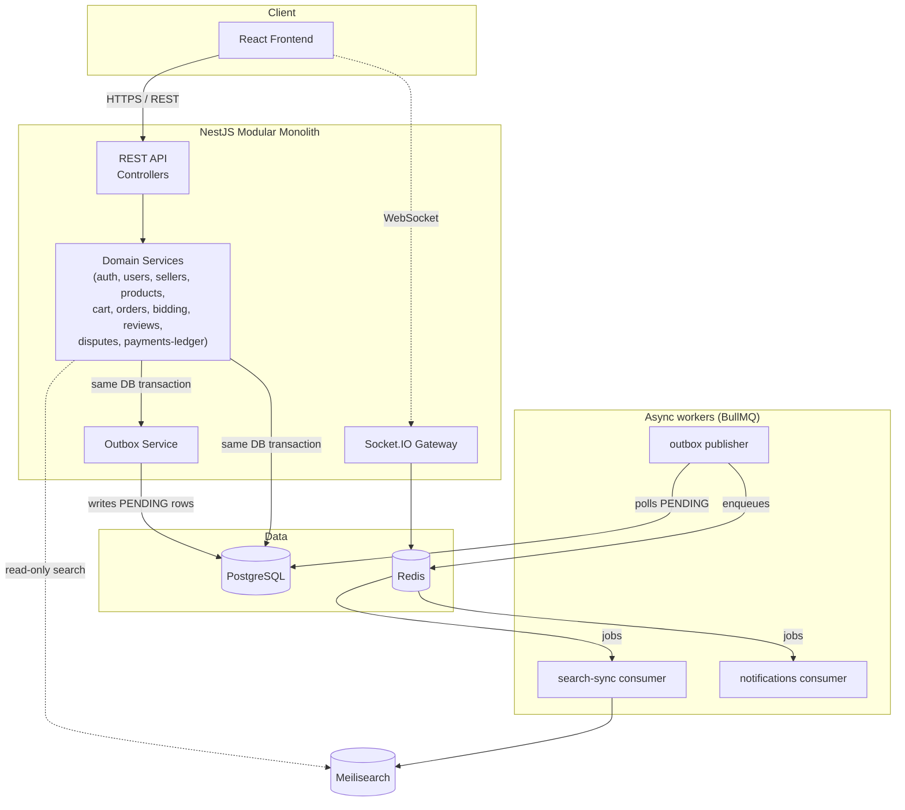

# Cargo Crew — Multi-Vendor Marketplace

A general-purpose, high-volume multi-vendor marketplace (think: many independent sellers, fixed-price and auction
listings, per-seller order splitting, commissions). This repository currently contains **Stage 1: Foundation +
Architecture** — a clean, production-minded skeleton that later stages build features into, not a finished product.

## Table of contents

- [Technology stack](#technology-stack)
- [Architecture](#architecture)
- [Why these choices](#why-these-choices)
- [Consistency model](#consistency-model)
- [Project structure](#project-structure)
- [Development setup](#development-setup)
- [Docker setup](#docker-setup)
- [Environment variables](#environment-variables)
- [Current implementation status](#current-implementation-status)

## Technology stack

**Backend** — NestJS, TypeScript, PostgreSQL + TypeORM (migrations only, no `synchronize`), Redis, BullMQ,
Meilisearch, Socket.IO, Swagger/OpenAPI, class-validator, Helmet, `@nestjs/throttler`, structured logging
(`nestjs-pino`).

**Frontend** — React, TypeScript, Vite, React Router, TanStack Query, Axios, Tailwind CSS.

**Infrastructure** — Docker Compose (Postgres, Redis, Meilisearch, backend, frontend), GitHub Actions CI.

## Architecture

**Modular monolith.** The backend is a single NestJS application internally partitioned into feature modules with
hard boundaries (`auth`, `users`, `sellers`, `products`, `categories`, `search-sync`, `cart`, `orders`, `bidding`,
`payments-ledger`, `analytics`, `notifications`, `reviews`, `disputes`, `outbox`, `metrics`). Each module follows the
same internal layering:

```
controller → service (application logic) → repository / entity (persistence)
```

Domain/service code does not import BullMQ, Meilisearch, or Socket.IO clients directly — those live behind small
ports (e.g. `SearchIndexPort`) or dedicated infrastructure modules (`queue/`, `search/`, `websocket/`, `redis/`), so
the underlying tool can be swapped without touching business logic.

We deliberately did **not** split this into microservices. At this stage (and likely for a long time after), a
marketplace of this scope doesn't have the team size, deployment cadence, or genuinely independent scaling needs that
justify the operational cost of service boundaries, network calls, and distributed transactions. A modular monolith
gives the same internal separation of concerns with one deployable, one database connection pool, and simple
transactions — and the module boundaries mean it *can* be peeled apart later if a specific module (e.g. `search-sync`
or `bidding`) genuinely needs to scale independently.



## Why these choices

- **PostgreSQL** — strong relational integrity (foreign keys, constraints) for financial and ownership data
  (orders, commissions, ledger entries) where correctness matters more than schema flexibility. `numeric` columns
  for all money fields — never floating point.
- **TypeORM** — first-class NestJS integration, migration tooling, and repository pattern that keeps persistence
  concerns out of domain services. `synchronize` is hard-disabled; schema changes are always explicit migrations.
- **BullMQ + Redis** — a mature, Redis-backed job queue with retries, backoff, and delayed jobs, used as the
  transport for everything downstream of the transactional outbox (search sync, notifications, seller-order
  processing, auction finalization). Redis doubles as the Socket.IO adapter backing store in later stages.
- **Meilisearch** — fast, typo-tolerant search with a much lower operational footprint than Elasticsearch/OpenSearch
  for a marketplace of this scale, and a simple HTTP API that's easy to abstract behind a port interface.
- **Modular monolith over microservices** — see [Architecture](#architecture) above.

## Consistency model

- **Strong consistency**: everything financially or transactionally critical (orders, seller-order splits,
  commissions, ledger entries, cart mutations) is a PostgreSQL transaction. No dual writes to two systems inside a
  single business operation.
- **Eventual consistency**: anything derived — the search index, notifications, WebSocket broadcasts — is updated
  through the **transactional outbox** pattern:

  ```
  DB transaction (domain change + OutboxEvent row)
      → COMMIT
      → publisher worker polls PENDING outbox rows
      → BullMQ job
      → consumer (search-sync / notifications / …)
      → ProcessedEvent row makes the consumer idempotent against redelivery
  ```

  This means a service is never in a position where the domain write succeeds but the Meilisearch/notification write
  silently fails (or vice versa) — the outbox row is the single source of truth for "this needs to be propagated,"
  and consumers can be retried safely.

Stage 1 puts the tables, the `OutboxService.record()` helper, and the consumer-side services in place. The publisher
worker and the individual `@Processor` classes that actually move events from Postgres to BullMQ to Meilisearch are
implemented in later stages, once there's real domain data flowing through them.

## Project structure

```
/backend
  src/
    common/        # config, filters, middleware, logger, decorators
    database/      # TypeORM data source, migrations, shared base entity
    redis/         # shared ioredis client
    queue/         # BullMQ connection + queue name registry
    search/        # SearchIndexPort abstraction + Meilisearch implementation
    websocket/     # Socket.IO gateway foundation
    health/        # /health (Postgres, Redis, Meilisearch checks)
    modules/       # one folder per domain module (see Architecture)
/frontend
  src/
    api/           # Axios client, typed API calls
    app/           # App shell, providers, error boundary, query client
    components/    # ui/ (buttons, cards, …) and layout/ (header, footer, nav)
    config/        # typed env access
    features/      # feature-scoped logic (auth, catalog queries)
    hooks/
    layouts/       # CustomerLayout, SellerLayout, AdminLayout, AuthLayout
    pages/         # customer/, seller/, admin/ page shells
    routes/        # router config, ProtectedRoute
    styles/        # design tokens (theme.css)
    types/
```

## Development setup

Requires Node 20+ and Docker.

```bash
# Backend
cd backend
npm install
cp ../.env.example ../.env   # or export the vars another way
npm run start:dev            # requires Postgres/Redis/Meilisearch reachable — see Docker setup

# Frontend
cd frontend
npm install
npm run dev                  # http://localhost:5173
```

Useful backend scripts:

```bash
npm run lint            # eslint
npm run build            # nest build
npm run test              # unit tests
npm run migration:generate -- src/database/migrations/SomeName
npm run migration:run
npm run migration:revert
```

Frontend scripts: `npm run lint` (oxlint), `npm run typecheck`, `npm run build`.

## Docker setup

```bash
cp .env.example .env
docker compose up --build -d
docker compose exec backend npm run migration:run:prod   # first run only
```

This starts Postgres, Redis, Meilisearch, the backend (`:3000`), and the frontend (`:5173`), all with healthchecks.
Postgres data lives in a named volume (`postgres_data`) and survives `docker compose down` / restarts — only
`docker compose down -v` discards it.

- API: http://localhost:3000/api
- Swagger: http://localhost:3000/api/docs
- Health: http://localhost:3000/api/health
- Frontend: http://localhost:5173

Migrations are **not** run automatically on container start — they're an explicit step (`migration:run:prod`, which
runs against the compiled `dist/` output so the runtime image doesn't need dev dependencies or `ts-node`). This
keeps schema changes deliberate rather than something that silently happens on every deploy.

## Environment variables

See `.env.example` for the full list with comments. No real secrets are committed.

**Google OAuth** is optional in every environment. Leave `GOOGLE_OAUTH_CLIENT_ID`/`GOOGLE_OAUTH_CLIENT_SECRET` blank
and `GET /auth/google` responds with a clear 400 instead of the backend failing to start — email/password auth is
unaffected. To enable it: create an OAuth 2.0 Client ID (Google Cloud Console → APIs & Services → Credentials), set
the authorized redirect URI to `GOOGLE_OAUTH_CALLBACK_URL` (`http://localhost:3000/api/auth/google/callback` by
default), and fill in the three `GOOGLE_OAUTH_*` vars.

**Admin bootstrap**: set `ADMIN_EMAIL`/`ADMIN_PASSWORD`/`ADMIN_NAME`, then run `npm run seed:admin` (or
`npm run seed:admin:prod` / `docker compose exec backend npm run seed:admin:prod` against a built image). Safe to
run repeatedly — it promotes an existing user or creates one, never duplicates.

## Current implementation status

**Done (Stage 1):**

- Modular monolith skeleton with all 16 domain modules wired into `AppModule`, each following
  controller → service → repository layering.
- Full domain schema (19 entities) with relations, constraints, `numeric` money columns, immutable order-line
  snapshots, and optimistic-locking support on `Auction` — plus a generated-and-verified initial migration.
- Transactional outbox tables (`OutboxEvent`, `ProcessedEvent`) and an `OutboxService.record()` helper for future
  domain writes to use.
- Cross-cutting foundation: global validation, Helmet, CORS, rate limiting, centralized exception handling,
  correlation-ID middleware, structured JSON logging, Swagger, `/health` (Postgres + Redis + Meilisearch),
  `/metrics` (process metrics).
- Redis/BullMQ queue registry, a `SearchIndexPort` abstraction over Meilisearch (not called from any write path yet),
  and a minimal Socket.IO gateway.
- Frontend foundation: routing, TanStack Query wired to the real (currently empty) `/products` and `/categories`
  endpoints, an original "Cargo Crew" visual identity, three role-based layouts (customer/seller/admin), and shell
  pages for every route in the spec — pages with no backend yet clearly show "not available" states instead of fake
  data.
- Docker Compose stack with healthchecks for all five services; verified end-to-end including data persistence
  across restarts.
- CI (lint/build/test for both apps).

**Done (Stage 2):**

- Email/password auth: `POST /auth/register|login|refresh|logout`, bcrypt password hashing, JWT access tokens
  (in-memory on the client) + opaque rotating refresh tokens (sha256-hashed in Postgres, httpOnly cookie, reuse
  detection revokes the whole session).
- RBAC: global `JwtAuthGuard` + `RolesGuard` (fail-closed — every route requires auth unless `@Public()`), `@Roles()`
  and `@CurrentUser()` decorators. Identity for seller applications always comes from the authenticated principal,
  never a client-supplied id.
- Seller application lifecycle: `POST /seller-applications`, `GET /seller-applications/me`, and admin moderation
  (`GET/PATCH /admin/seller-applications/...`) — transactional approve/reject with a DB partial unique index
  preventing more than one PENDING application per user, and reviewer/timestamp/outbox events recorded on decision.
- Google OAuth (`AuthIdentity` table, `LOCAL`/`GOOGLE` providers) with safe account linking by verified email; cleanly
  disabled (400, not a crash) when `GOOGLE_OAUTH_CLIENT_ID/SECRET` aren't set.
- `npm run seed:admin` — idempotent admin bootstrap from `ADMIN_EMAIL/PASSWORD/NAME`.
- Frontend wired to the real API: in-memory access token, silent session restoration via `/auth/refresh` on load,
  single-flight refresh-on-401 with no retry loop, role-gated `/seller/*` and `/admin/*` routes, a real seller
  application flow at `/account/seller`, and real admin moderation UI at `/admin/sellers`.
- 34 backend unit tests + 21 e2e tests (register → login → RBAC → apply → approve/reject → refresh
  rotation/reuse/logout) all passing against live Postgres/Redis/Meilisearch.

**Explicitly out of scope still** (see module/service comments for where each plugs in): product CRUD, catalog →
Meilisearch sync, cart/checkout logic, commission calculation, seller-order fulfillment, refunds, live bidding, full
WebSocket event rooms, review/dispute workflows, analytics.
