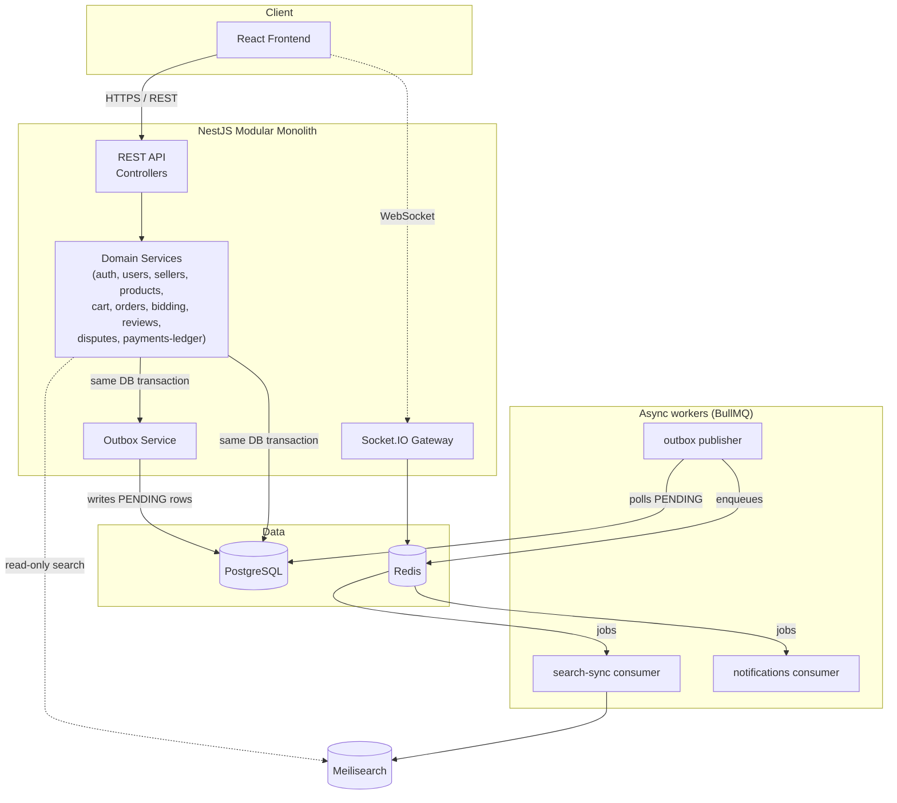

# Cargo Crew — Multi-Vendor Marketplace

A general-purpose, high-volume multi-vendor marketplace (think: many independent sellers, fixed-price and auction
listings, per-seller order splitting, commissions). This repository covers **Stages 1–9**: foundation + architecture,
auth + seller moderation, catalog + search, cart/checkout/orders, seller-order lifecycle, auctions, post-commit
realtime delivery with reconnect/resync, reviews/disputes/analytics, and full frontend integration (see
[Current implementation status](#current-implementation-status)) — a production-minded build-out, not a finished
product. See [Known limitations](#known-limitations--what-would-be-improved-with-more-time) for what's intentionally
out of scope.

## Table of contents

- [Technology stack](#technology-stack)
- [Architecture](#architecture)
- [Why these choices](#why-these-choices)
- [Consistency model](#consistency-model)
- [Catalog & search (Stage 3)](#catalog--search-stage-3)
- [Cart, checkout & orders (Stage 4)](#cart-checkout--orders-stage-4)
- [Seller order lifecycle, cancellation & refunds (Stage 5)](#seller-order-lifecycle-cancellation--refunds-stage-5)
- [Realtime protocol (Stage 7)](#realtime-protocol-stage-7)
- [Reviews, disputes, and analytics (Stage 8)](#reviews-disputes-and-analytics-stage-8)
- [Frontend integration (Stage 9)](#frontend-integration-stage-9)
- [Project structure](#project-structure)
- [Development setup](#development-setup)
- [Docker setup](#docker-setup)
- [Environment variables](#environment-variables)
- [Current implementation status](#current-implementation-status)
- [Observability](#observability)
- [Load testing](#load-testing)
- [Security](#security)
- [Testing](#testing)
- [CI](#ci)
- [Known limitations & what would be improved with more time](#known-limitations--what-would-be-improved-with-more-time)

## Technology stack

**Backend** — NestJS, TypeScript, PostgreSQL + TypeORM (migrations only, no `synchronize`), Redis, BullMQ,
Meilisearch, Socket.IO, Swagger/OpenAPI, class-validator, Helmet, `@nestjs/throttler`, structured logging
(`nestjs-pino`).

**Frontend** — React, TypeScript, Vite, React Router, TanStack Query, Axios, Tailwind CSS.

**Infrastructure** — Docker Compose (Postgres, Redis, Meilisearch, backend, frontend), GitHub Actions CI.

## Architecture

**Modular monolith.** The backend is a single NestJS application internally partitioned into feature modules with
hard boundaries (`auth`, `users`, `sellers`, `products`, `categories`, `search-sync`, `cart`, `orders`, `bidding`,
`payments-ledger`, `analytics`, `notifications`, `reviews`, `disputes`, `outbox`, `metrics`). Each module follows the
same internal layering:

```
controller → service (application logic) → repository / entity (persistence)
```

Domain/service code does not import BullMQ, Meilisearch, or Socket.IO clients directly — those live behind small
ports (e.g. `SearchIndexPort`) or dedicated infrastructure modules (`queue/`, `search/`, `websocket/`, `redis/`), so
the underlying tool can be swapped without touching business logic.

We deliberately did **not** split this into microservices. At this stage (and likely for a long time after), a
marketplace of this scope doesn't have the team size, deployment cadence, or genuinely independent scaling needs that
justify the operational cost of service boundaries, network calls, and distributed transactions. A modular monolith
gives the same internal separation of concerns with one deployable, one database connection pool, and simple
transactions — and the module boundaries mean it *can* be peeled apart later if a specific module (e.g. `search-sync`
or `bidding`) genuinely needs to scale independently.



## Why these choices

- **PostgreSQL** — strong relational integrity (foreign keys, constraints) for financial and ownership data
  (orders, commissions, ledger entries) where correctness matters more than schema flexibility. `numeric` columns
  for all money fields — never floating point.
- **TypeORM** — first-class NestJS integration, migration tooling, and repository pattern that keeps persistence
  concerns out of domain services. `synchronize` is hard-disabled; schema changes are always explicit migrations.
- **BullMQ + Redis** — a mature, Redis-backed job queue with retries, backoff, and delayed jobs, used as the
  transport for everything downstream of the transactional outbox (search sync, notifications, seller-order
  processing, auction finalization). Redis also backs the Socket.IO adapter so room broadcasts span backend replicas.
- **Meilisearch** — fast, typo-tolerant search with a much lower operational footprint than Elasticsearch/OpenSearch
  for a marketplace of this scale, and a simple HTTP API that's easy to abstract behind a port interface.
- **Modular monolith over microservices** — see [Architecture](#architecture) above.

## Consistency model

- **Strong consistency**: everything financially or transactionally critical (orders, seller-order splits,
  commissions, ledger entries, cart mutations) is a PostgreSQL transaction. No dual writes to two systems inside a
  single business operation.
- **Eventual consistency**: anything derived — the search index, notifications, WebSocket broadcasts — is updated
  through the **transactional outbox** pattern:

  ```
  DB transaction (domain change + OutboxEvent row)
      → COMMIT
      → publisher worker polls PENDING outbox rows
      → BullMQ job
      → consumer (search-sync / notifications / …)
      → ProcessedEvent row makes the consumer idempotent against redelivery
  ```

  This means a service is never in a position where the domain write succeeds but the Meilisearch/notification write
  silently fails (or vice versa) — the outbox row is the single source of truth for "this needs to be propagated,"
  and consumers can be retried safely.

The full pipeline (outbox row → publisher poll → BullMQ job → search-sync consumer → Meilisearch) is implemented as
of Stage 3, described in detail below.

## Catalog & search (Stage 3)

### Product ownership

A `Product` belongs to exactly one `SellerProfile`. Every seller-scoped endpoint (`/seller/products/*`) resolves the
caller's `sellerProfileId` from the authenticated JWT (`@CurrentUser()` → `SellersService.findProfileByUserId()`) —
never from a client-supplied `sellerId`. Ownership is enforced by scoping the lookup query itself to
`(id, sellerProfileId)` rather than fetching by id and checking ownership afterwards: a product that exists but
belongs to another seller is indistinguishable from one that doesn't exist, so an id another seller can guess never
confirms it exists (404, not 403 — see `ProductsService.findOwnedById`).

### Why direct dual-writes are avoided

`ProductsService`/`CategoriesService` never call Meilisearch. A write path that did `await postgres.save(product);
await meilisearch.index(doc);` has no atomicity — if the process crashes, times out, or Meilisearch is briefly
down between those two calls, Postgres and the search index permanently disagree, with nothing to reconcile them.
Instead, every mutation writes an `OutboxEvent` **in the same transaction** as the domain change:

```
BEGIN
  UPDATE products SET ...
  INSERT INTO outbox_events (eventType: 'PRODUCT_UPDATED', aggregateId: product.id, ...)
COMMIT
```

Either both rows commit or neither does — there's no window where the product changed but nothing recorded that
the search index needs to catch up.

### Outbox → BullMQ → Meilisearch

- **`OutboxPublisherService`** (`modules/outbox/outbox-publisher.service.ts`) polls every 2s for `PENDING` rows using
  `SELECT ... FOR UPDATE SKIP LOCKED` (safe if multiple app instances poll concurrently), enqueues each onto the
  `search-sync` BullMQ queue with `jobId = outboxEvent.id` (so a retried publish can't double-enqueue), and only
  flips the row to `PUBLISHED` after the enqueue succeeds. If BullMQ/Redis is briefly down, the row just stays
  `PENDING` and is retried on the next tick — the original product transaction already committed and is unaffected.
- **`SearchSyncProcessor`** (`modules/search-sync/search-sync.processor.ts`) consumes those jobs. It checks
  `ProcessedEvent` first (idempotency: a duplicate delivery is a no-op) and, on `PRODUCT_CREATED`/`PRODUCT_UPDATED`,
  **re-fetches the current product from Postgres** rather than trusting the event payload as a data snapshot — the
  payload only carries `{ productId }`. This makes redelivery and out-of-order processing self-healing: whichever
  event runs last always writes the *current* truth, not a stale delta. `CATEGORY_UPDATED` re-syncs every product in
  that category (category name is denormalized into each product's search document). Sync failures are re-thrown so
  BullMQ's configured retry/backoff applies; success is only recorded (`ProcessedEvent` insert) after the Meilisearch
  write is confirmed — see "Meilisearch task model" below.

### Meilisearch task model

Meilisearch's write endpoints return as soon as a task is *enqueued*, not once it's applied — `addDocuments()` can
resolve successfully even though the underlying task later fails (this bit us during development: a product
document with `id`, `sellerId`, and `categoryId` all ending in "id" made Meilisearch's primary-key auto-detection
ambiguous, and the failure was only visible in the task log, not the API response). `MeilisearchService` now
declares the primary key explicitly and calls `.waitTask()` to confirm each write actually succeeded before
resolving, turning a would-be silent failure into a normal thrown error that the retry/idempotency logic already
handles correctly.

### Search document & facets

The `products` Meilisearch index holds a flattened, public-safe read model (`ProductSearchDocument`) — seller name
and category name are denormalized in, but nothing seller-private (no email, no commission rate). Configured via
`PRODUCTS_INDEX_SETTINGS`:

- **Searchable**: `name`, `description`, `sellerName`, `categoryName`
- **Filterable**: `categoryId`, `sellerId`, `price`, `rating`, `available`, `productType`
- **Sortable**: `price`, `createdAt`, `rating`

`GET /products` requests facet distributions for `categoryId`/`sellerId`/`available`/`productType` alongside the
search results in a single call, which is what the catalog page's filter sidebar renders — no extra per-facet
requests.

### Graceful degradation

`ProductsService.searchCatalog()` tries Meilisearch first; if it throws (down, timed out — `MeilisearchService`
enforces a 2s client-side timeout so a hung connection can't hang the request), it falls back to
`PostgresCatalogFallbackService`, which serves the same filters/sort/pagination directly from Postgres (ILIKE name
search backed by a `pg_trgm` GIN index — see migrations) at reduced relevance and with facets omitted. The catalog
never 500s just because the search engine is unavailable; the fallback is logged so persistent outages aren't
silent.

### Redis caching

`CatalogCacheService` caches public, non-personalized reads only — search results (5s TTL), product details (60s),
and the category list (5m). Seller-scoped endpoints (`/seller/products/*`) are never cached. Search results use a
version counter (`catalog:search:version`) rather than tracking individual query keys: any product/category
mutation increments the counter, which changes every subsequent cache key and makes prior entries unreachable
(they simply expire) — cheaper and more reliable than enumerating and deleting cached query shapes. Product/category
detail caches are invalidated by key on every mutation to that specific row. All cache operations degrade to a
cache-miss (not an error) if Redis is unavailable.

### Reindexing

`npm run search:reindex` (`npm run search:reindex:prod` against a built image) rebuilds the `products` index from
Postgres from scratch: configures index settings, then upserts every published product in batches. Idempotent —
safe to rerun on a fresh environment, in CI, or to recover after search-sync has been down. Not exposed as an HTTP
endpoint (destructive/expensive operations like this stay CLI-only).

## Cart, checkout & orders (Stage 4)

### Parent Order vs SellerOrder

A customer's cart can hold products from multiple sellers. Checkout produces exactly **one `Order`** (the buyer's
receipt — total amount, shipping address, overall status) and **one `SellerOrder` per distinct seller** in that
cart, each holding its own `subtotal`/`commissionAmount`/`sellerNetAmount` and its own `SellerOrderItem` rows
(immutable snapshots of `productName`/`unitPrice`/`quantity`/`lineTotal` at the moment of purchase — later catalog
edits never change what a past order shows). `Order.status` starts at `PENDING_PAYMENT` (this stage doesn't process
real payment capture); each `SellerOrder.status` starts at `AWAITING_FULFILLMENT` and is moved to `PROCESSING`
asynchronously (see below). Fulfillment/shipping/cancellation lifecycles beyond that are out of this stage's scope.

### Checkout is one transaction

`POST /cart/checkout` (`CheckoutService.checkout`) does everything inside a single `EntityManager.transaction`:
claim the idempotency key → re-validate every cart item against the *current* product state → atomically decrement
stock per item → create the `Order` → create one `SellerOrder` + its items per seller → write `SALE_CREDIT` /
`COMMISSION_DEBIT` ledger entries → write `ORDER_CREATED` / `SELLER_ORDER_CREATED` / `STOCK_CHANGED` outbox events →
clear the cart → mark the idempotency key `COMPLETED`. Any failure at any point — a stock conflict on the third
item, a product that became unpublished, whatever — rolls back the *entire* transaction: the two items already
decremented for a different seller in the same checkout are restored, no partial `Order`/`SellerOrder` rows exist,
and the cart is untouched. Nothing is trusted from the client except *which* products and quantities the customer
wants — prices, seller identity, and totals are always re-read from Postgres inside the transaction, never accepted
from the request body.

### Atomic stock deduction

The critical piece: stock is decremented with a single guarded `UPDATE`, not a read-then-write:

```sql
UPDATE products SET "stockQuantity" = "stockQuantity" - :qty
WHERE id = :id AND "stockQuantity" >= :qty
```

If the `WHERE` clause matches zero rows, `affected === 0` and the code throws — meaning either the row didn't exist
or (the real case) stock was insufficient *at the instant of the SQL update*, which Postgres's row-level locking
makes safe under concurrency without needing an explicit `SELECT ... FOR UPDATE`: two concurrent checkouts racing
for the last unit each issue this `UPDATE`, the database serializes them at the row level, and only one can see
`stockQuantity >= qty` still hold. Verified directly against Postgres: 10 concurrent checkout attempts against
`stockQuantity = 3` produce exactly 3 successes, 7 conflicts, and a final stock of `0` — never negative. Cart items
within one checkout are processed in deterministic `productId` order specifically to avoid deadlocking against a
*different* concurrent checkout that touches an overlapping set of products in a different order.

### Commission & money

Every `SellerProfile` has its own `commissionRatePercent` (defaults to 10%, not a single hardcoded platform
constant) — checkout multiplies each seller's subtotal by their own rate, so a future per-seller negotiated rate
just works. All arithmetic happens in integer cents (`common/utils/money.ts`, `bigint`), converting to/from the
`numeric(12,2)` decimal-string columns only at the boundary — this avoids the classic floating-point cents-drift bug
entirely. Rounding is round-half-up, applied once per computed value (e.g. commission is rounded once from
`subtotal * rate`, never accumulated from per-line-item roundings), so results are deterministic and reproducible.

### Ledger

Two `LedgerEntry` rows are written per `SellerOrder`: `SALE_CREDIT` for the full subtotal, `COMMISSION_DEBIT` for
the platform's cut — both tagged with the same `correlationId` as the checkout request and the `sellerOrderId` they
belong to, so `SALE_CREDIT − COMMISSION_DEBIT` always reconciles to `sellerNetAmount`, and a support/audit query can
find every ledger row one checkout produced by correlation ID. The ledger is append-only by design (see
`LedgerEntry` doc comment) — balances are always derived by summing entries, never mutated in place.

### Checkout idempotency

`POST /cart/checkout` requires an `Idempotency-Key` header. The key is claimed by inserting a
`CheckoutIdempotencyKey(customerId, idempotencyKey)` row as the **first** write inside the checkout transaction,
under a unique index on `(customerId, idempotencyKey)`. That unique index is what makes concurrent duplicate
requests safe, not application-level locking: Postgres makes a second transaction's conflicting `INSERT` *block*
until the first transaction commits or rolls back, then either raises `unique_violation` (first one committed — the
second replays the stored `orderId`) or succeeds normally (first one rolled back — the key was never claimed, so
the second proceeds as a fresh attempt). There's deliberately no `FAILED` status: a failed checkout rolls back the
whole transaction, the idempotency insert included, so a failed attempt leaves no durable row and the same key can
simply be retried. Verified against real Postgres: 5 *simultaneous* requests with the same key all resolve to the
same single order, with exactly one `Order` row created.

The frontend generates the key once per checkout page visit (`crypto.randomUUID()`) and reuses it for every submit
attempt during that visit, so a double-click or a retried request after a network hiccup replays instead of
duplicating; a fresh page visit gets a fresh key.

### Outbox events, after the transaction commits — not before

`ORDER_CREATED` (aggregate `Order`), one `SELLER_ORDER_CREATED` per seller (aggregate `SellerOrder`), and one
`STOCK_CHANGED` per product touched (aggregate `Product`) are written as `OutboxEvent` rows in the *same* checkout
transaction — never published to BullMQ directly from inside it. `OutboxPublisherService` now routes by
`event.aggregateType`: `Product`/`Category` → `search-sync` (Stage 3, unchanged), `SellerOrder` →
`seller-order-processing` (new), `Order` → `notifications` (new; no consumer yet, since a full notification UI is
out of this stage's scope — jobs simply accumulate there, harmless and easy to wire up later). `STOCK_CHANGED` reuses
`SearchSyncProcessor`'s existing `syncProduct()` handler (same case as `PRODUCT_UPDATED`), so the Meilisearch
document — which already includes `stockQuantity`/`available` — catches up to the post-checkout stock level through
the normal outbox pipeline, not a direct write from `CheckoutService`. Redis cache invalidation for the touched
products/search results happens as a best-effort step *after* the transaction commits, for the same reason: a Redis
write is never rolled back by a Postgres `ROLLBACK`, so doing it inside the transaction could invalidate a cache
entry for a checkout that then fails.

### Async SellerOrder processing

`SellerOrderProcessingProcessor` (queue: `seller-order-processing`) consumes `SELLER_ORDER_CREATED` events and moves
the `SellerOrder` from `AWAITING_FULFILLMENT` to `PROCESSING`. Same idempotency shape as `SearchSyncProcessor`: a
`ProcessedEvent` row short-circuits redelivery, the transition only ever moves forward from
`AWAITING_FULFILLMENT` (so replaying an already-applied event is a safe no-op), and a `SellerOrder` that's gone
missing by the time the job runs is logged and skipped rather than throwing.

### Strong vs eventual consistency, in this stage

- **Strong (one Postgres transaction)**: cart→order conversion, stock deduction, the Order/SellerOrder split,
  commission calculation, ledger entries, idempotency claim.
- **Eventual (outbox → BullMQ, after commit)**: SellerOrder status flipping to `PROCESSING`, the search index
  picking up the new stock level, Redis cache invalidation.

### Checkout flow

```
Customer                CheckoutService                    Postgres                  Outbox → BullMQ
   |  POST /cart/checkout   |                                  |                              |
   |  Idempotency-Key: K    |                                  |                              |
   |------------------------>  BEGIN TRANSACTION                                              |
   |                        |  INSERT idempotency_keys(K) ----> (unique index claims K)        |
   |                        |  re-validate cart items ---------> products (published, price)   |
   |                        |  UPDATE products SET stock -= qty WHERE stock >= qty (per item)  |
   |                        |     -> 0 rows affected? THROW (whole txn rolls back)             |
   |                        |  INSERT orders (1 row)                                            |
   |                        |  INSERT seller_orders (1 per seller) + seller_order_items         |
   |                        |  INSERT ledger_entries (SALE_CREDIT + COMMISSION_DEBIT per seller)|
   |                        |  INSERT outbox_events (ORDER_CREATED, SELLER_ORDER_CREATED x N,   |
   |                        |                         STOCK_CHANGED x N)                        |
   |                        |  DELETE cart_items                                                |
   |                        |  UPDATE idempotency_keys SET status = COMPLETED                   |
   |                        |  COMMIT ------------------------------------------------------->  |
   |  <---------------------|  { orderId, sellerOrders[], totalAmount, replayed: false }        |
   |                        |                                                                    |
   |                        |  (best-effort, post-commit) invalidate product/search cache        |
   |                        |                                                                    |
   |                        |                        outbox publisher polls PENDING every 2s ---> BullMQ
   |                        |                                                     search-sync queue: STOCK_CHANGED
   |                        |                                          seller-order-processing queue: SELLER_ORDER_CREATED
   |                        |                                                       notifications queue: ORDER_CREATED
```

### Customer / seller / admin order APIs

Same ownership pattern as Stage 3's seller-scoped product endpoints: every handler resolves identity from the
JWT (`@CurrentUser()`), never from the URL/body, and scopes the query by `(id, ownerId)` together so a mismatched
id reads as 404, not 403 — an id another customer/seller can guess never confirms it exists.

| Route | Role | Scope | Notes |
|---|---|---|---|
| `GET /cart`, `POST /cart/items`, `PATCH /cart/items/:productId`, `DELETE /cart/items/:productId`, `DELETE /cart` | CUSTOMER | own cart | grouped by seller; rejects auction listings |
| `POST /cart/checkout` | CUSTOMER | own cart | requires `Idempotency-Key` header |
| `GET /orders`, `GET /orders/:id` | CUSTOMER | own orders (`buyerId`) | omits `commissionAmount`/`sellerNetAmount` — buyer doesn't need the platform's cut |
| `GET /seller/orders`, `GET /seller/orders/:id` | SELLER | own `SellerProfile`'s seller orders | includes full commission/net breakdown for that seller only |
| `GET /admin/orders`, `GET /admin/orders/:id` | ADMIN | unscoped | full financial visibility across every order |

### Frontend

`/cart` (seller-grouped line items, quantity steppers, remove/clear — quantity and removal mutations are optimistic
with rollback via TanStack Query's `onMutate`/`onError`, since those two interactions are the ones a customer
repeats rapidly; adding a new product stays a plain invalidate-on-success mutation, matching the rest of this
codebase, since the server computes pricing/seller-grouping the client doesn't have), `/checkout` (order summary,
optional shipping address, a client-generated idempotency key reused for the whole page visit, submit button
disabled while the request is in flight), `/account/orders` + `/account/orders/:id` (customer order history),
`/seller/orders` + `/seller/orders/:id` (seller order queue with commission/net breakdown), `/admin/orders` +
`/admin/orders/:id` (full admin visibility). `/cart` and `/checkout` are gated to the `CUSTOMER` role client-side,
matching the backend's `@Roles(CUSTOMER)` restriction on those endpoints.

## Seller order lifecycle, cancellation & refunds (Stage 5)

### SellerOrder status lifecycle

```
AWAITING_FULFILLMENT → PROCESSING → SHIPPED → DELIVERED
        │                   │
        └──────► CANCELLED ◄┘            (SHIPPED/DELIVERED cannot cancel — see below)
```

Every transition is validated by one function, `assertValidStatusTransition` (`orders/domain/seller-order-status.policy.ts`)
— a lookup table of legal `from → to` pairs, called by both the seller-facing (`PATCH /seller/orders/:id/status`) and
admin-facing (`PATCH /admin/seller-orders/:id/status`) endpoints. There's no separate admin code path with looser
rules: admin privileges widen *who* can act on a given SellerOrder (unscoped vs. owned-only), never *what*
transitions are valid. `COMPLETED → PROCESSING`, `CANCELLED → SHIPPED`, and every other backward/lateral move is
rejected with 409 before touching any row.

Cancellation is a **separate, dedicated endpoint** (`POST .../cancel`), not a status value reachable through the
generic status endpoint — `CANCELLED` never appears as a legal target in the transition table, so a client can't
"PATCH its way" into cancelling. It's only allowed from `AWAITING_FULFILLMENT` or `PROCESSING`: once a SellerOrder
is `SHIPPED`, the seller has already handed the item to a carrier and incurred fulfillment cost, so cancellation
stops being the right tool — a partial refund (below) is used instead post-shipment.

### Parent Order aggregation

The parent `Order.status` is never set directly by any controller — it's always *derived* from every one of its
SellerOrders' current status, by a pure function (`deriveParentOrderStatus`, `orders/domain/order-aggregate-status.ts`)
called after every SellerOrder mutation. Two axes:

1. **Cancellation is orthogonal to progress.** Some (not all) SellerOrders `CANCELLED` → `PARTIALLY_CANCELLED`,
   regardless of how advanced the rest are. All `CANCELLED` → `CANCELLED`.
2. **Otherwise, the spread across non-cancelled SellerOrders' fulfillment rank** (`AWAITING_FULFILLMENT` <
   `PROCESSING` < `SHIPPED` < `DELIVERED`) decides it: all equal → the pure state (`NEW`/`PROCESSING`/`SHIPPED`/`COMPLETED`);
   a spread → the `PARTIALLY_*` variant of whichever end is furthest along (`PARTIALLY_SHIPPED`, `PARTIALLY_COMPLETED`).

```
Order #100
  SellerOrder A: PROCESSING → SHIPPED → COMPLETED
  SellerOrder B: PROCESSING → CANCELLED

Order.status over time: NEW → PROCESSING → PARTIALLY_SHIPPED → PARTIALLY_CANCELLED
                         (both AWAITING)   (A ships, B still   (B cancelled; A's progress
                                             PROCESSING)         no longer matters — some
                                                                  cancelled always wins)
```

### Independent SellerOrder cancellation

**Critical invariant: cancelling SellerOrder A must never affect SellerOrder B under the same Order.** The
cancellation transaction (`SellerOrderLifecycleService.cancel`) locks only the target SellerOrder row
(`SELECT ... FOR UPDATE`), reads only *its* `SellerOrderItem`s, restores stock only for *its* products, and writes
reversal ledger entries scoped only to *its* `sellerOrderId` — there is no code path that touches a sibling
SellerOrder's rows. Verified directly (both the unit suite and a dedicated e2e scenario): cancelling one
SellerOrder in a two-seller Order leaves the other's status, stock, and ledger completely untouched, and the parent
recomputes to `PARTIALLY_CANCELLED`.

```
BEGIN
  SELECT SellerOrder ... FOR UPDATE                 -- serializes concurrent cancel/status/refund calls on this row
  already CANCELLED? → COMMIT as a no-op (idempotent replay, no re-mutation)
  assertCancellable(status)                          -- 409 if SHIPPED/DELIVERED
  for each SellerOrderItem: UPDATE products SET stockQuantity += qty
  INSERT ledger_entries: SELLER_EARNING_REVERSAL (=subtotal), PLATFORM_COMMISSION_REVERSAL (=commission)
  UPDATE seller_orders SET status = CANCELLED
  recompute + persist parent Order.status if changed
  INSERT outbox_events: SELLER_ORDER_CANCELLED, STOCK_CHANGED (per product), ORDER_STATUS_CHANGED (if changed)
COMMIT
```

**Idempotency and concurrency** come from the same row lock, not a separate mechanism: two simultaneous cancel
requests both attempt `SELECT ... FOR UPDATE` on the same row — Postgres serializes them, the first to commit wins,
the second re-reads the now-`CANCELLED` row and returns early without restoring stock or writing ledger entries a
second time. Verified with 5 truly concurrent cancel requests against one SellerOrder: stock restored exactly
once, exactly 4 ledger rows (2 original + 2 reversal, never more).

### Financial correction model — append-only, never mutated

Cancelling or refunding never rewrites the original `SALE_CREDIT`/`COMMISSION_DEBIT` ledger entries from checkout,
or the SellerOrder's original `subtotal`/`commissionAmount`/`sellerNetAmount` columns — those stay exactly as
checkout wrote them, forever. Corrections are new, separate ledger rows: `SELLER_EARNING_REVERSAL` (mirrors
`SALE_CREDIT`'s magnitude) and `PLATFORM_COMMISSION_REVERSAL` (mirrors `COMMISSION_DEBIT`'s), so
`SALE_CREDIT − SELLER_EARNING_REVERSAL` and `COMMISSION_DEBIT − PLATFORM_COMMISSION_REVERSAL` always reconcile to
the current effective figures. A full cancellation reverses the entire pair; a partial refund reverses only the
refunded portion. Effective totals (`deriveSellerOrderFinancialSummary`, `orders/domain/financial-summary.ts`) are
always *derived* at read time from the original figures plus completed `Refund` rows (or, for a cancelled
SellerOrder, a full reversal by definition) — never stored, so there's exactly one source of truth for "what does
this seller order actually net out to right now."

### Partial refunds

A `Refund` is scoped to one `SellerOrderItem` and a quantity, not the whole SellerOrder — `SellerOrder.status`
itself never changes for a partial refund (it's a financial correction, not a fulfillment state change). Refund
eligibility requires the SellerOrder to be past `AWAITING_FULFILLMENT` (nothing to refund yet — cancel instead) and
not `CANCELLED` (already fully reversed) — enforced by the same `assertRefundable` policy function pattern as
status transitions.

**Calculation is entirely server-side**, from the `SellerOrderItem`'s immutable purchase snapshot (`unitPrice`),
never the product's current price and never a client-supplied amount:

```
refundGross = item.unitPrice × requestedQuantity
commissionCorrection = refundGross × (sellerOrder.commissionAmount / sellerOrder.subtotal)   -- applyRatio()
sellerCorrection = refundGross − commissionCorrection
```

Using the SellerOrder's *own stored* commission/subtotal ratio (not the seller's current live commission rate)
means the numbers still reconcile exactly even if that rate changes later — refunding every unit of an item always
sums back to exactly the original commission, with round-half-up integer-cents arithmetic and zero drift (see
`applyRatio` in `common/utils/money.ts`).

**Remaining refundable quantity** is `item.quantity − Σ(quantity of that item's COMPLETED refunds)`, computed
inside the same transaction that locks the SellerOrder row — a request for more than what remains is rejected
(409) before any stock or ledger mutation. Refunded stock is restored by the same simple, explicit rule as
cancellation (see `RESTORE_STOCK_ON_REFUND` in `refunds.service.ts`): a refunded unit always returns to sellable
stock in this stage, deliberately not reason-dependent.

### Refund idempotency

`Refund` doubles as its own idempotency claim — a unique index on `(sellerOrderId, idempotencyKey)` means the
`INSERT` itself is what makes a retried or truly concurrent duplicate request produce exactly one row, the same
mechanism `CheckoutIdempotencyKey` uses in Stage 4: the amounts are computed *before* the insert (unlike checkout,
nothing async needs to happen first), so a single insert both claims the key and records the completed refund.
Verified with 5 simultaneous requests carrying the same `Idempotency-Key`: all resolve to the same single `Refund`
id, with exactly one row persisted.

### Cancellation vs. refund — two mechanisms that never cross-corrupt

| | Cancellation | Partial refund |
|---|---|---|
| Scope | Entire SellerOrder | Specific `SellerOrderItem` + quantity |
| When | Not yet shipped (`AWAITING_FULFILLMENT`/`PROCESSING`) | Shipped or later, not cancelled |
| SellerOrder.status | → `CANCELLED` | Unchanged |
| Reversal | 100% of subtotal/commission | Proportional to the refunded quantity |
| Idempotency | SellerOrder row lock + status check | `Refund` row's own unique constraint |

A refund attempt against an already-`CANCELLED` SellerOrder is rejected outright (`assertRefundable`), and a
cancel attempt against a SellerOrder with existing partial refunds is impossible in practice — a SellerOrder only
becomes refund-eligible once it's `PROCESSING` or later, which is already past the cancellation window. The two
code paths never both try to reverse the same money.

### Outbox events (Stage 5 additions)

`SELLER_ORDER_STATUS_CHANGED`, `SELLER_ORDER_CANCELLED`, `ORDER_STATUS_CHANGED` (aggregate `SellerOrder`/`Order`)
and `REFUND_CREATED` (aggregate `Refund`, routed to the same `notifications` queue as `Order` events) are written
in the same transaction as the state change they describe, same as every other outbox event in this codebase —
never published before commit. The `SellerOrder`-aggregate events route to the existing `seller-order-processing`
consumer, which handles them as an idempotent observability hook (structured log + metric) rather than a state
change: the transition already happened synchronously inside the request, so there's nothing left for the async
consumer to *do* — but routing them through the same `ProcessedEvent`-deduplicated pipeline proves redelivery is
still safe. (A `LEDGER_ADJUSTED` event was deliberately **not** added — there's no consumer that would act on it in
this stage, and an event with no queue route just produces noisy "no route" log lines; ledger corrections are
already fully traceable via `LedgerEntry.refundId`/`sellerOrderId`/`correlationId`.)

### Consistency boundaries

- **Strong (one Postgres transaction, same as Stage 4)**: status transitions, cancellation (stock restore + ledger
  reversal + parent recompute), refund creation (calculation + ledger + stock restore + idempotency claim).
- **Eventual (outbox → BullMQ, after commit)**: search index catching up to restored stock (`STOCK_CHANGED` →
  the existing `search-sync` consumer, unchanged from Stage 4), Redis product/search cache invalidation.

## Project structure

```
/backend
  src/
    common/        # config, filters, middleware, logger, decorators
    database/      # TypeORM data source, migrations, shared base entity
    redis/         # shared ioredis client
    queue/         # BullMQ connection + queue name registry
    search/        # SearchIndexPort abstraction + Meilisearch implementation
    websocket/     # Socket.IO gateway foundation
    health/        # /health (Postgres, Redis, Meilisearch checks)
    modules/       # one folder per domain module (see Architecture)
/frontend
  src/
    api/           # Axios client, typed API calls
    app/           # App shell, providers, error boundary, query client
    components/    # ui/ (buttons, cards, …) and layout/ (header, footer, nav)
    config/        # typed env access
    features/      # feature-scoped logic (auth, catalog queries)
    hooks/
    layouts/       # CustomerLayout, SellerLayout, AdminLayout, AuthLayout
    pages/         # customer/, seller/, admin/ page shells
    routes/        # router config, ProtectedRoute
    styles/        # design tokens (theme.css)
    types/
```

## Development setup

Requires Node 20+ and Docker.

```bash
# Backend
cd backend
npm install
cp ../.env.example ../.env   # or export the vars another way
npm run start:dev            # requires Postgres/Redis/Meilisearch reachable — see Docker setup

# Frontend
cd frontend
npm install
npm run dev                  # http://localhost:5173
```

Useful backend scripts:

```bash
npm run lint            # eslint
npm run build            # nest build
npm run test              # unit tests
npm run migration:generate -- src/database/migrations/SomeName
npm run migration:run
npm run migration:revert
```

Frontend scripts: `npm run lint` (oxlint), `npm run typecheck`, `npm run build`.

## Docker setup

```bash
cp .env.example .env
docker compose up --build -d
docker compose exec backend npm run migration:run:prod   # first run only
```

This starts Postgres, Redis, Meilisearch, the backend (`:3000`), and the frontend (`:5173`), all with healthchecks.
Postgres data lives in a named volume (`postgres_data`) and survives `docker compose down` / restarts — only
`docker compose down -v` discards it.

- API: http://localhost:3000/api
- Swagger: http://localhost:3000/api/docs
- Health: http://localhost:3000/api/health
- Frontend: http://localhost:5173

Migrations are **not** run automatically on container start — they're an explicit step (`migration:run:prod`, which
runs against the compiled `dist/` output so the runtime image doesn't need dev dependencies or `ts-node`). This
keeps schema changes deliberate rather than something that silently happens on every deploy.

## Environment variables

See `.env.example` for the full list with comments. No real secrets are committed.

### Google OAuth setup

Optional in every environment — leave `GOOGLE_OAUTH_CLIENT_ID`/`GOOGLE_OAUTH_CLIENT_SECRET` blank and
`GET /auth/google` responds with a clear `400` instead of the backend failing to start; email/password auth is
completely unaffected either way. To enable it:

1. In [Google Cloud Console](https://console.cloud.google.com/apis/credentials) → APIs & Services → Credentials →
   **Create Credentials → OAuth client ID**, choose **Web application**.
2. Under **Authorized redirect URIs**, add exactly:
   ```
   http://localhost:3000/api/auth/google/callback
   ```
   This is the backend's callback route (`AuthController.googleCallback`, mounted under the global `api` prefix) —
   there is exactly one canonical callback URL, and it must match `GOOGLE_OAUTH_CALLBACK_URL` below exactly
   (including the `/api` prefix). Under **Authorized JavaScript origins**, add the frontend origin,
   `http://localhost:5173` — the app the user's browser is actually on when they click "Continue with Google".
3. While the OAuth consent screen is in **Testing** mode (the default for a new project), only accounts added under
   **Audience → Test users** in Cloud Console can complete the consent flow — add your own Google account there
   before testing.
4. Copy the generated Client ID and Client Secret into `.env` (never commit real values):
   ```
   GOOGLE_OAUTH_CLIENT_ID=your-client-id.apps.googleusercontent.com
   GOOGLE_OAUTH_CLIENT_SECRET=your-client-secret
   GOOGLE_OAUTH_CALLBACK_URL=http://localhost:3000/api/auth/google/callback
   ```
5. Restart the backend to pick up the change: `docker compose up -d --build backend` (Docker) or restart
   `npm run start:dev` (local). `docker-compose.yml`'s backend service already loads the whole `.env` file
   (`env_file: - .env`), so no separate Docker Compose edit is needed for these three variables.

**Flow**: `GET /auth/google` (redirects to Google) → user consents → Google redirects to
`GET /auth/google/callback` → backend finds-or-creates the local `User` (linked via a separate `AuthIdentity` row,
matched to an existing account only by *verified* email — new accounts always default to role `CUSTOMER`, never
`SELLER`/`ADMIN`) → issues the same access/refresh JWT pair as normal login (refresh token set as an httpOnly
cookie, same rotation/hash/reuse-detection as email/password auth) → redirects to `${FRONTEND_URL}/auth/callback`
(no token in the URL) → the frontend's `AuthCallbackPage` waits for the mount-time `/auth/refresh` call to pick up
that cookie, then routes into the app. A failed callback (e.g. an unverified Google email) redirects back to
`/login?error=google_oauth_failed` with a plain-language message instead of surfacing a raw JSON error.

**Admin bootstrap**: set `ADMIN_EMAIL`/`ADMIN_PASSWORD`/`ADMIN_NAME`, then run `npm run seed:admin` — locally or
against a running container (`docker compose exec backend npm run seed:admin`; runs the compiled
`dist/scripts/seed-admin.js`, so `npm run build` must have produced `dist/` first — already true for any image built
from the Dockerfile). This is an explicit, developer-triggered command only — it never runs automatically on
application startup. Safe to run repeatedly and never creates a duplicate user for `ADMIN_EMAIL`, but it is **not**
a no-op on repeat runs: every run syncs the account's role/name/verification/password to the current env, so
changing `ADMIN_PASSWORD` and re-running is how you rotate the admin's password.

## Current implementation status

**Done (Stage 1):**

- Modular monolith skeleton with all 16 domain modules wired into `AppModule`, each following
  controller → service → repository layering.
- Full domain schema (19 entities) with relations, constraints, `numeric` money columns, immutable order-line
  snapshots, and optimistic-locking support on `Auction` — plus a generated-and-verified initial migration.
- Transactional outbox tables (`OutboxEvent`, `ProcessedEvent`) and an `OutboxService.record()` helper for future
  domain writes to use.
- Cross-cutting foundation: global validation, Helmet, CORS, rate limiting, centralized exception handling,
  correlation-ID middleware, structured JSON logging, Swagger, `/health` (Postgres + Redis + Meilisearch),
  `/metrics` (process metrics).
- Redis/BullMQ queue registry, a `SearchIndexPort` abstraction over Meilisearch (not called from any write path yet),
  and a minimal Socket.IO gateway.
- Frontend foundation: routing, TanStack Query wired to the real (currently empty) `/products` and `/categories`
  endpoints, an original "Cargo Crew" visual identity, three role-based layouts (customer/seller/admin), and shell
  pages for every route in the spec — pages with no backend yet clearly show "not available" states instead of fake
  data.
- Docker Compose stack with healthchecks for all five services; verified end-to-end including data persistence
  across restarts.
- CI (lint/build/test for both apps).

**Done (Stage 2):**

- Email/password auth: `POST /auth/register|login|refresh|logout`, bcrypt password hashing, JWT access tokens
  (in-memory on the client) + opaque rotating refresh tokens (sha256-hashed in Postgres, httpOnly cookie, reuse
  detection revokes the whole session).
- RBAC: global `JwtAuthGuard` + `RolesGuard` (fail-closed — every route requires auth unless `@Public()`), `@Roles()`
  and `@CurrentUser()` decorators. Identity for seller applications always comes from the authenticated principal,
  never a client-supplied id.
- Seller application lifecycle: `POST /seller-applications`, `GET /seller-applications/me`, and admin moderation
  (`GET/PATCH /admin/seller-applications/...`) — transactional approve/reject with a DB partial unique index
  preventing more than one PENDING application per user, and reviewer/timestamp/outbox events recorded on decision.
- Google OAuth (`AuthIdentity` table, `LOCAL`/`GOOGLE` providers) with safe account linking by verified email; cleanly
  disabled (400, not a crash) when `GOOGLE_OAUTH_CLIENT_ID/SECRET` aren't set.
- `npm run seed:admin` — explicit admin bootstrap/sync from `ADMIN_EMAIL/PASSWORD/NAME`: creates the account if
  missing, otherwise syncs role/name/verification/password to the current env (never a duplicate user, never run
  automatically on startup).
- Frontend wired to the real API: in-memory access token, silent session restoration via `/auth/refresh` on load,
  single-flight refresh-on-401 with no retry loop, role-gated `/seller/*` and `/admin/*` routes, a real seller
  application flow at `/account/seller`, and real admin moderation UI at `/admin/sellers`.
- 34 backend unit tests + 21 e2e tests (register → login → RBAC → apply → approve/reject → refresh
  rotation/reuse/logout) all passing against live Postgres/Redis/Meilisearch.

**Done (Stage 3):**

- Seller-owned product CRUD (`/seller/products/*`) — ownership enforced by query scoping (404, not 403, on
  cross-seller access), deterministic slug generation with a DB-unique-constraint retry loop for real races, admin
  category CRUD with a 409 on deleting a category that still has products.
- Real transactional-outbox → BullMQ → Meilisearch search sync, described in detail above — no direct dual-writes.
- Public catalog (`GET /products`) backed by Meilisearch with facets, filters, sort, and pagination, plus an
  automatic Postgres fallback (with a `pg_trgm`-indexed ILIKE search) if Meilisearch is unavailable.
- Redis caching for public catalog reads (search results, product detail, category list) with mutation-driven
  invalidation; never applied to seller-scoped reads.
- `npm run search:reindex` for rebuilding the index from Postgres from a clean state.
- Frontend: real catalog page (search/facets/price range/sort/pagination, all synced to the URL), seller product
  management UI, admin category management UI, an enhanced product detail page.
- 63 backend unit tests + 38 e2e tests (including IDOR checks, outbox→search-sync eventual consistency with actual
  wait-for-indexing assertions, idempotent redelivery, category-rename propagation, and cache-invalidation
  freshness) all passing against live Postgres/Redis/Meilisearch. CI now runs a dedicated e2e job with real service
  containers.

**Done (Stage 4):**

- Real cart (`/cart/*`) — seller-grouped, fixed-price-only (auctions rejected), replacing the Stage 1 stub
  (including its insecure `GET /cart/by-user/:userId`, which trusted a client-supplied user id).
- `POST /cart/checkout` — one Postgres transaction produces one parent `Order` split into one `SellerOrder` per
  seller, with atomic guarded-`UPDATE` stock deduction (never a read-then-write), per-seller commission calculated
  from that seller's own `commissionRatePercent`, append-only ledger entries, and outbox events — all described in
  detail above. Verified directly against Postgres: correct multi-seller split/commission/rounding, full rollback
  (no partial orders, stock restored, cart untouched, idempotency key freed) when one seller in a multi-seller
  checkout lacks stock, and exactly N successes out of M concurrent buyers racing for N units of stock.
- Idempotent checkout via a Postgres-persisted `Idempotency-Key` (not Redis-only) — verified safe under truly
  simultaneous duplicate requests, not just sequential retries.
- Async `SellerOrder` fulfillment-queue processing (`AWAITING_FULFILLMENT` → `PROCESSING`) via the same
  outbox → BullMQ → idempotent-consumer pipeline as Stage 3's search sync, now routed by `aggregateType`.
- Customer/seller/admin order read APIs, each ownership-scoped with the same 404-not-403 pattern as Stage 3's
  seller-product endpoints; the customer view deliberately omits commission/net figures the admin/seller views
  include.
- Money arithmetic done in integer cents (`common/utils/money.ts`) with round-half-up rounding, never floating
  point.
- Business/domain Prometheus counters (`checkout_attempts_total`, `checkout_succeeded_total`,
  `checkout_failed_total`, `checkout_idempotent_replays_total`, `stock_conflicts_total`,
  `seller_orders_processed_total`) alongside the existing process metrics at `/metrics`.
- Frontend: real cart page with optimistic quantity/removal mutations and rollback, a checkout page with
  client-generated idempotency key and duplicate-submit prevention, and order-history views for all three roles —
  described in detail above.
- 93 backend unit tests (up from 63) + 61 e2e tests (up from 38), including a dedicated checkout e2e suite covering
  the full multi-vendor flow, atomic rollback, 10-way concurrency, sequential and simultaneous idempotent replay,
  and IDOR across all three order-API roles — all passing against live Postgres/Redis/Meilisearch. The e2e CI job's
  throttle ceiling was raised (`RATE_LIMIT_MAX_REQUESTS`) for that job only, since the concurrency/idempotency
  scenarios legitimately fire many requests from one IP in a short window; production's default throttle is
  unchanged.

**Done (Stage 5):**

- SellerOrder status lifecycle (`AWAITING_FULFILLMENT → PROCESSING → SHIPPED → DELIVERED`) enforced by one
  centralized transition policy (`orders/domain/seller-order-status.policy.ts`), shared verbatim by the
  seller-facing (`PATCH /seller/orders/:id/status`) and admin-facing (`PATCH /admin/seller-orders/:id/status`)
  endpoints — admin privileges widen who can act, never what transitions are valid.
- Parent `Order.status` is a pure derived aggregate (`orders/domain/order-aggregate-status.ts`) recomputed after
  every SellerOrder change — new minimal status set (`NEW`/`PROCESSING`/`PARTIALLY_SHIPPED`/`SHIPPED`/
  `PARTIALLY_COMPLETED`/`COMPLETED`/`PARTIALLY_CANCELLED`/`CANCELLED`) replacing Stage 4's payment-oriented one.
- Independent SellerOrder cancellation (`POST .../cancel`, seller- and admin-facing) — one transaction, row-locked,
  restores only that SellerOrder's stock, reverses only its ledger entries, and is idempotent under true
  concurrency (verified: 5 simultaneous cancel requests on one SellerOrder restore stock and reverse the ledger
  exactly once). Verified independently: cancelling one SellerOrder under a multi-seller Order never touches a
  sibling's status, stock, or ledger.
- Append-only financial corrections — `SELLER_EARNING_REVERSAL`/`PLATFORM_COMMISSION_REVERSAL` ledger entries,
  never mutating or deleting the original `SALE_CREDIT`/`COMMISSION_DEBIT` rows; effective totals always derived
  at read time (`orders/domain/financial-summary.ts`), never stored, so there's one source of truth.
- Partial, item-level refunds (`POST /admin/seller-orders/:id/refunds`, admin-only) — server-computed
  amount/commission/seller corrections from the immutable purchase snapshot (never the client, never current
  product price), remaining-refundable-quantity validation, and stock restoration. `Refund` doubles as its own
  Postgres-persisted idempotency claim (unique `(sellerOrderId, idempotencyKey)`) — verified safe under 5
  simultaneous duplicate requests (exactly one `Refund` row) and rejects over-refunding with zero side effects.
- New Stage 5 outbox events (`SELLER_ORDER_STATUS_CHANGED`, `SELLER_ORDER_CANCELLED`, `ORDER_STATUS_CHANGED`,
  `REFUND_CREATED`) routed and consumed idempotently through the existing outbox → BullMQ → `ProcessedEvent`
  pipeline; `STOCK_CHANGED` reuses Stage 4's search-sync path unchanged, so cancelled/refunded stock eventually
  reflects in search the same way a checkout-driven stock change does.
- New Prometheus counters: `seller_order_status_changes_total`, `seller_order_cancellations_total`,
  `refunds_total`, `refund_failures_total`, `refund_amount_total` (cents).
- Frontend: seller order-detail page gained status-advance/cancel actions; customer order-detail page shows the
  derived parent status, per-item refunded quantities, and original/refunded/effective totals (still no
  commission/payout visibility); admin order-detail page gained per-SellerOrder cancel and a partial-refund form
  that only ever shows the backend-computed result, never accepts a typed amount.
- 163 backend unit tests (up from 93) + 79 e2e tests (up from 61), including a dedicated lifecycle/cancellation/
  refund e2e suite covering independent cancellation, cancellation idempotency under true concurrency, partial
  refund calculation, refund idempotency (sequential and simultaneous), over-refund rejection, invalid transition
  rejection, and IDOR across every new endpoint — all passing against live Postgres/Redis/Meilisearch.

**Explicitly out of scope still** (see module/service comments for where each plugs in): full parent-`Order`
cancellation/refund initiated *from* the parent (only per-SellerOrder actions exist), dispute-driven refunds
(the `Refund.disputeId` column exists but is always null this stage), review/dispute workflows, and final analytics.

**Done (Stage 6):**

- One Auction per `AUCTION` Product, with `SCHEDULED → ACTIVE → AWAITING_PAYMENT → COMPLETED` as the successful
  path; `UNSOLD` means no valid bids, `EXPIRED` means the winner did not purchase in time, and `CANCELLED` is seller/admin moderation before a
  winner exists. Seller ownership is always derived through the Product's SellerProfile.
- Bid placement is append-only and Postgres-authoritative. `POST /auctions/:id/bids` locks the Auction row with
  `SELECT ... FOR UPDATE`, then checks the deadline and current minimum *after* acquiring that lock. The first bid
  may equal `startPrice`; later bids require `currentPrice + minBidIncrement`. Two equal concurrent bids therefore
  produce exactly one accepted row. A unique `(auctionId, bidderId, idempotencyKey)` index and an under-lock replay
  lookup make retries safe, including simultaneous duplicates.
- Auction finalization and winner-window expiry use durable BullMQ delayed jobs with deterministic job IDs. A
  periodic Postgres reconciliation sweep catches overdue rows if Redis was unavailable or a delayed job was lost.
  Both handlers lock the Auction and are status-checked no-ops on redelivery.
- The winner gets a configurable purchase window (`AUCTION_PURCHASE_WINDOW_MINUTES`, default 30). Winner checkout
  is a dedicated, idempotent transaction: guarded stock decrement, one Order/SellerOrder/item snapshot at the
  winning Bid amount, existing integer-cent commission rounding, append-only ledger entries, and Outbox events.
  The normal cart continues to reject auction products.
- Auction price/status changes write `PRODUCT_UPDATED`/`STOCK_CHANGED` outbox rows; search-sync re-fetches the
  current Postgres read model and updates Meilisearch asynchronously. Redis product/search caches are invalidated
  only after commit. `BID_PLACED`, finalization, purchase, and expiry events remain available for Stage 7 realtime
  notifications without broadcasting before commit.
- Frontend product details now show a yellow auction console with current price, minimum next bid, countdown,
  realtime bid history with a low-frequency REST fallback, bid errors, and winner purchase CTA. Sellers configure and monitor auctions at
  `/seller/auctions`; admins have a minimal operational view at `/admin/auctions`.

### Auction timing and recovery sequence

```mermaid
sequenceDiagram
  participant Buyer
  participant API
  participant PG as PostgreSQL
  participant Q as BullMQ
  Buyer->>API: POST bid + Idempotency-Key
  API->>PG: BEGIN; SELECT Auction FOR UPDATE
  API->>PG: deadline/minimum check; Bid + Auction + Outbox; COMMIT
  Q->>API: delayed FINALIZE at endsAt
  API->>PG: lock Auction; winner/window or ENDED; Outbox; COMMIT
  Note over API,PG: Reconciliation repeats overdue work idempotently
  Buyer->>API: winner checkout + Idempotency-Key
  API->>PG: stock + Order + SellerOrder + Ledger + Outbox; COMMIT
```

The deadline uses application-server time captured only after the row lock is held. Consequently, a request that
arrived before `endsAt` but acquires the lock at or after it is rejected. Stage 7 keeps a low-frequency REST polling
fallback while Socket.IO is the primary update mechanism.

## Realtime protocol (Stage 7)

PostgreSQL remains authoritative. Domain transactions write Outbox rows; the publisher fans committed events to a
dedicated `realtime` BullMQ queue; an idempotent consumer re-fetches current database state before asking the thin
gateway to emit it. No business service emits a socket event before commit, and sockets expose no mutation commands.
The Redis Socket.IO adapter is installed before the HTTP/socket server starts, so room memberships are never created
on a temporary in-memory adapter during startup. If that adapter cannot connect, startup falls back to single-instance
socket delivery while REST remains usable and the failure is logged/metered.

```text
PostgreSQL transaction + OutboxEvent
        → COMMIT
        → OutboxPublisher
        → BullMQ realtime queue
        → ProcessedEvent-aware consumer
        → Socket.IO room (Redis adapter)
```

Connect to `VITE_SOCKET_URL` (normally the backend origin) with optional access-token auth:

```ts
io(socketUrl, { auth: { token: accessToken } })
```

No token creates a public-only session. A supplied invalid or expired token rejects the connection; it never silently
downgrades to public. Authenticated sockets automatically join `user:{userId}` and approved sellers also join
`seller:{sellerProfileId}`. Identity and role are reloaded from PostgreSQL, never accepted from the handshake payload.

| Client message | Authorization | Resulting room |
|---|---|---|
| `subscribe:product { id }` / `unsubscribe:product` | Public, existing published product | `product:{productId}` |
| `subscribe:auction { id }` / `unsubscribe:auction` | Public, existing auction | `auction:{auctionId}` |
| `subscribe:order { id }` / `unsubscribe:order` | Owning customer or admin only | `order:{orderId}` |

Arbitrary user or seller room subscriptions do not exist. Sellers receive only their own private stream through the
server-derived automatic seller room.

| Server event | Audience | Minimal authoritative payload |
|---|---|---|
| `product.stock.updated` | Product room | product id, current stock, updated timestamp |
| `auction.bid.updated` | Auction room | current price, minimum next bid, bid count, deadline/status |
| `auction.started/finalized/won/unsold` | Auction room | current public auction state |
| `auction.purchase_window.opened/purchased/expired` | Auction room | current public auction state/window timestamps |
| `order.status.updated` | Owning user, owning seller, authorized order room | parent and seller-order ids/statuses, timestamp |
| `dispute.opened/updated/resolved` | Owning customer and seller private rooms | dispute and seller-order ids, status, timestamp |

The shared frontend socket reconnects with bounded Socket.IO backoff, updates authentication whenever the in-memory
access token changes, and re-subscribes mounted product/auction/order hooks after reconnect. Crucially, reconnect does
not attempt event replay: TanStack Query invalidates active catalog/product/auction and role-relevant order/dashboard
queries, refetching REST state before continuing live updates. Duplicate messages are safe cache updates, and payload
timestamps prevent an older stock/auction event from overwriting newer cached state. If Redis or WebSockets are down,
all REST flows continue working; the auction view retains a low-frequency REST fallback.

## Reviews, disputes, and analytics (Stage 8)

- Reviews are anchored to a `SellerOrderItem`, not merely a product id. The API verifies that the authenticated
  customer owns the parent Order, the SellerOrder is `DELIVERED`, and at least one purchased unit remains after
  completed refunds. A unique `(sellerOrderItemId, customerId)` constraint prevents duplicate purchase reviews.
- Review create/update/delete locks the Product, mutates the Review, recomputes `ratingAverage`/`ratingCount`, and
  writes `PRODUCT_UPDATED` in one PostgreSQL transaction. Search rating follows the existing Outbox → BullMQ →
  Meilisearch path; Redis product/search caches are invalidated only after commit.
- Disputes belong to one SellerOrder and follow `OPEN → UNDER_REVIEW → RESOLVED_CUSTOMER|RESOLVED_SELLER → CLOSED`.
  A partial unique index permits only one active dispute per SellerOrder. Customer and seller reads are ownership
  scoped and return sanitized views; only Admin can resolve.
- A customer-favor dispute refund calls the existing Stage 5 transaction-aware refund implementation. Dispute state,
  Refund, append-only ledger corrections, stock restoration, and Outbox events therefore commit or roll back together.
  Private `dispute.opened/updated/resolved` events reuse the Stage 7 user/seller rooms.
- Seller and admin dashboards use bounded SQL `GROUP BY` read models over Orders, SellerOrders, Refunds, Products,
  Auctions, and the append-only Ledger. Platform revenue is effective commission
  (`COMMISSION_DEBIT - PLATFORM_COMMISSION_REVERSAL`); seller net also accounts for sale credits and both reversal
  types. Reports are cached in Redis for 45 seconds under role/seller/date-scoped keys.
- Cart conversion is explicitly an approximation: successful fixed-price checkout idempotency records divided by
  successful checkouts plus non-empty carts created in the selected period. Auction winner checkout is excluded.
- Admin JSON export uses schema version `1.0`. CSV export contains daily effective figures, applies RFC-style quote
  escaping, and prefixes cells beginning with `=`, `+`, `-`, or `@` to prevent spreadsheet formula injection.

## Frontend integration (Stage 9)

The React application exposes the completed marketplace capabilities through role-aware routes rather than API-only
workflows:

- Customers use `/catalog`, `/product/:id`, `/cart`, `/checkout`, `/account/orders`, and `/account/seller` for
  search/facets, fixed-price and auction purchases, grouped multi-seller checkout, order/refund/dispute history,
  verified reviews, and seller applications.
- Sellers use `/seller/products`, `/seller/orders`, `/seller/auctions`, `/seller/disputes`, and the seller dashboard
  for owned inventory, fulfillment, auction configuration/details, case responses, and date-scoped analytics.
- Admins use `/admin/sellers`, `/admin/categories`, `/admin/orders`, `/admin/auctions`, `/admin/disputes`, and
  `/admin/analytics` for moderation, financial inspection/refunds, operational auction detail, dispute resolution,
  platform reporting, and server-generated CSV/JSON exports.

The shared Socket.IO provider remains optional infrastructure: product, auction, order, and dispute events update or
invalidate TanStack Query state, while reconnect always performs an authoritative REST resync. A small connection
indicator reports Live/Reconnecting/Offline without blocking normal REST use. Navigation, dashboards, forms, cards,
empty/error/loading states, and data-heavy views share the existing responsive Cargo Crew design system.

Frontend checks are `npm run lint`, `npm run typecheck`, `npm test`, and `npm run build`. Storybook is configured
(`npm run storybook` / `npm run build-storybook`) with stories for the core `components/ui` primitives
(`Button`, `Card`, `Badge`, `Spinner`, `EmptyState`); focused Vitest tests cover important UI decision rules.

## Observability

- **Structured logging**: `nestjs-pino` (JSON in production, pretty-printed in dev), globally installed via
  `app.useLogger()`. Built-in redaction for `Authorization`/`Cookie`/`Set-Cookie` headers — verified no
  passwordHash/refresh-token/OAuth-secret ever appears in a log line. Domain services (checkout, bids, auction
  finalization, refunds, disputes, seller moderation, queue processors) log structured events with the relevant
  aggregate IDs and the request's correlation ID.
- **Correlation ID**: `CorrelationIdMiddleware` reads `x-correlation-id` or generates a UUID per request, echoed back
  as a response header. It is threaded explicitly (not via `AsyncLocalStorage`) through every layer of the primary
  async flow: HTTP handler → domain service → `OutboxService.record(manager, { correlationId, ... })` (written in
  the same DB transaction as the domain change) → `OutboxPublisherService` copies it into the BullMQ job payload →
  every queue processor (`SearchSyncProcessor`, `SellerOrderProcessingProcessor`, `RealtimeProcessor`,
  `AuctionFinalizationProcessor`, `NotificationsProcessor`) logs it on every step. One correlation ID is traceable
  end-to-end from the originating HTTP request through to the async side effect it caused.
- **`/metrics`** (Prometheus text format, `@Public()`, unauthenticated like a normal scrape target): process metrics
  (uptime, RSS, heap) plus a lightweight in-process counter/gauge/histogram registry
  (`MetricsRegistryService` — deliberately hand-rolled rather than `prom-client`, since this stage only needs a
  handful of monotonic counters and two histograms, not a full client library; per-process, not
  cross-instance-aggregated). Business/domain metrics actually emitted:
  - Checkout: `checkout_attempts_total`, `checkout_succeeded_total`, `checkout_failed_total`,
    `checkout_idempotent_replays_total`, `stock_conflicts_total`, `orders_created_total`
  - Auction checkout: `auction_checkout_attempts_total`, `auction_checkout_succeeded_total`,
    `auction_checkout_failed_total`, `auction_checkout_idempotent_replays_total`
  - Bidding: `bid_attempts_total`, `bids_placed_total`, `bids_rejected_total`, `bid_conflicts_total`,
    `bid_idempotent_replays_total`
  - Auctions: `auctions_won_total`, `auctions_unsold_total`, `auctions_cancelled_total`,
    `auction_purchase_windows_expired_total`
  - Orders/refunds: `seller_orders_processed_total`, `seller_order_status_changes_total`,
    `seller_order_cancellations_total`, `refunds_total`, `refund_failures_total`
  - Reviews/disputes/analytics: `reviews_created_total`, `disputes_opened_total`, `disputes_resolved_total`,
    `analytics_exports_total`
  - Notifications: `notifications_sent_total`
  - Queue processing (all 5 BullMQ consumers, via a shared `recordQueueJob()` helper): `queue_jobs_processed_total`,
    `queue_jobs_failed_total`, `queue_processing_duration_seconds` (histogram)
  - HTTP: `http_request_duration_seconds` (histogram, global interceptor, every request)
  - WebSocket: `websocket_connections_current` (gauge), `websocket_connections_total`,
    `websocket_disconnects_total`, `websocket_errors_total`, `websocket_events_emitted_total`
- **Queue failure observability**: every processor increments `queue_jobs_failed_total` and logs the error (with
  attempt count) before rethrowing, so BullMQ's configured retry/backoff applies and the failure is visible in both
  logs and `/metrics` — not just retried silently. The `NOTIFICATIONS` queue has a real consumer
  (`NotificationsProcessor`) with the same `ProcessedEvent`-dedup + metrics/logging shape as the other four.

## Load testing

See [`docs/load-test-report.md`](docs/load-test-report.md) for the full report and
[`load-tests/`](load-tests/) for the reproducible k6 scripts. Summary of the last executed run (concurrent auction
bidding, 7 bursts of 50 VUs each, against the real unmodified rate limit — no config changes): **10 accepted bids,
130 correctly-rejected conflicts, 210 correctly-throttled requests, 0 unexpected failures across 350 total
requests, 0 lost updates** — the auction's `currentPrice` exactly matched the highest of all 10
independently-persisted `Bid` rows after the run, verified by a separate consistency-check script. The report also
documents a real throttling bug found and fixed while calibrating this test (see "Security" above).

## Security

- **Validation**: every mutation endpoint uses a `class-validator`-annotated DTO; the global `ValidationPipe` sets
  `whitelist: true, forbidNonWhitelisted: true`, so unrecognized fields are rejected rather than silently dropped
  or passed through.
- **Injection/XSS**: all queries go through TypeORM's QueryBuilder/repository API with parameterized values — no
  raw string-interpolated SQL anywhere in the codebase. CSV export (`AdminAnalyticsController`) sanitizes formula
  injection (`=`, `+`, `-`, `@` prefixes get a leading `'` and standard quote-doubling) before writing any
  user-influenced value into a cell.
- **IDOR**: ownership is enforced by query-scoping (matching id *and* owner in the `WHERE` clause, returning 404
  rather than 403 on mismatch) across products, orders, seller-orders, disputes, and analytics — verified by
  dedicated e2e assertions in each stage's flow spec. `GET /users/:id` is admin-only and returns a DTO (never the
  raw `User` entity); `GET /sellers/:id` returns a public-safe DTO (`storeName`/`storeSlug`/`description`/`logoUrl`
  only — never `userId` or `commissionRatePercent`).
- **Rate limiting**: a single global throttler (`RATE_LIMIT_MAX_REQUESTS`/`RATE_LIMIT_TTL_SECONDS`, env-configurable,
  100/60s default) with dedicated stricter per-route overrides for `login` (5/60s), `register` (10/60s), and bid
  placement (20/10s, hardcoded — see note below) via `@Throttle()`. Only one named throttler is registered:
  `@nestjs/throttler` applies *every* registered named throttler to *every* route by default, so a second named
  throttler (tried during load-test calibration, to make the bid limit env-configurable) ended up rate-limiting
  unrelated endpoints too — a real bug, caught by the full e2e suite and reverted before submission; see
  `docs/load-test-report.md` for the detailed writeup. `/auth/refresh` is deliberately not specially throttled
  beyond the generous global default, since it's called on every page load to restore a session.
- **Sensitive data**: `passwordHash` is `select: false` at the column level and never included in any
  DTO/serializer; `RefreshToken.tokenHash` stores a SHA-256 hash, never the plaintext token, and is never returned
  by any endpoint; Google OAuth `clientSecret` lives only in server config. Pino's redaction config additionally
  strips `Authorization`/`Cookie` headers from every log line as a second layer of defense.

## Testing

- **Backend unit tests**: `cd backend && npm test` — 250 tests across 32 suites (Jest), covering commission/money
  math, bid accept/reject decision logic, parent-order aggregation, refund calculation, idempotency helpers, and
  outbox/processor dispatch logic in isolation.
- **Backend e2e tests**: `cd backend && npm run test:e2e -- --runInBand` — 96 tests across 8 suites, run against
  live Postgres/Redis/Meilisearch (`docker compose up -d postgres redis meilisearch`, then
  `npm run migration:run`). Covers, with real concurrent HTTP requests (not sequential mocked calls): multi-vendor
  checkout (stock/commission/SellerOrder-count correctness, atomic rollback), concurrent auction bidding (one
  consistent highest bid, no lost update), duplicate outbox/event delivery (effect applied once), SellerOrder
  lifecycle/independent cancellation, partial refunds/over-refund rejection, reviews/disputes/analytics IDOR, and
  realtime socket auth/room-scoping/reconnect-resync.
  - Note: running the full e2e suite locally while the Docker `backend` container is also running will cause both
    processes to compete for the same BullMQ jobs (each has its own Socket.IO server, so whichever instance's
    worker wins the job is the one that emits the realtime event) — `docker compose stop backend` first, or run e2e
    against a stack without the `backend` service started.
- **Frontend**: `cd frontend && npm test` — 10 tests across 3 files (Vitest), covering reconnect/resync query
  invalidation and dispute/review/refund eligibility and quantity-clamping business logic. Component/integration
  tests are optional per spec and were not expanded beyond what already existed.
- **Storybook**: `cd frontend && npm run build-storybook` builds a static Storybook with stories for the core
  `components/ui` primitives.

## CI

`.github/workflows/ci.yml` runs on every push/PR to `main`, three jobs:

- **`backend`**: lint, build, unit tests.
- **`backend-e2e`**: spins up real `postgres:16-alpine`, `redis:7-alpine`, and `getmeili/meilisearch:v1.10` service
  containers with health checks, runs migrations against them, then the full e2e suite — so search-sync/outbox
  behavior is exercised for real, never skipped or mocked in CI.
- **`frontend`**: lint, typecheck, unit tests, Storybook build, production build.

## Known limitations & what would be improved with more time

- **Multi-instance realtime fan-out**: the Socket.IO Redis adapter is wired up (so events fan out correctly across
  multiple backend instances), but this hasn't been load-tested with more than one backend replica running
  simultaneously.
- **Metrics are per-process, not aggregated**: `MetricsRegistryService` is an in-memory counter/histogram registry,
  fine for a single instance or this stage's purpose, but a real multi-instance deployment would want each
  instance's `/metrics` scraped independently by Prometheus (standard practice) rather than expecting one endpoint
  to reflect fleet-wide totals.
- **Notification delivery is log-only**: `NotificationsService.notify()` currently logs a structured message per
  recipient (real consumer, real recipient-resolution logic, real dedup — see "Async SellerOrder processing" and
  the outbox routing table) but doesn't yet persist an in-app notification record or send an email/push. Swapping
  in a real channel only touches that one class.
- **No distributed load-testing rig**: the load test (see `docs/load-test-report.md`) ran from a single machine
  against a single-instance local Docker stack; a proper multi-origin load-testing setup would exercise the
  bid-placement throttle and the concurrency logic simultaneously without needing a temporary throttle-config
  override for the test window.
- **Given more time**: add a saga-style compensation step for the rare case where an outbox event's async
  consumer permanently fails after exhausting BullMQ retries (currently: visible via `queue_jobs_failed_total` and
  logs, but no automatic alerting/dead-letter replay UI); expand Storybook coverage beyond the `components/ui`
  primitives to the composite feature components (auction panel, cart, seller product form); add label support to
  the metrics registry (or migrate to `prom-client`) so per-queue/per-route breakdowns are queryable instead of
  only aggregate totals.
